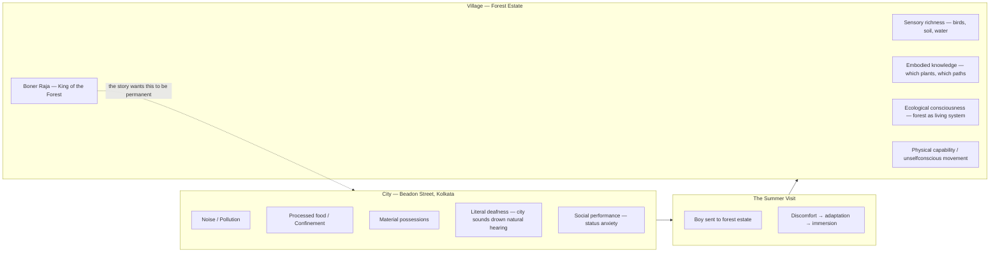

Jyotirindranath Nandi's Bengali short story as a meditation on the urban-rural divide — the city as spiritual and physical degradation, the forest estate as restoration. The city (Beadon Street, Kolkata): pollution, noise, confinement, processed food, material possessions, deafness both literal and metaphorical. The village: sensory richness, embodied knowledge, ecological consciousness.

## The Story's Architecture

## The Believability Problem

The story's structural weakness: the transformation is too rapid and complete to be psychologically credible. A summer visit doesn't undo decades of urban formation. Nandi's ecological instinct is correct — urban life does produce a particular kind of sensory atrophy — but the narrative mechanics are wishful.

The boy can't become Boner Raja through a summer. The story wants him to, which is the idealism that doesn't survive contact with how transformation actually works. Change of this depth requires structural change in the conditions of life, not an interlude and an act of will.

This connects to a broader pattern: Literature about urban-rural reconnection often functions as wish-fulfillment for urban readers who want to believe that a holiday could restore what years of city life have eroded. The desire is real. The mechanism isn't.

## The Broader Relevance

The same dynamic appears in the Indian IT generation — engineers formed by Mumbai/Bangalore who take a heritage trip to a village and feel "reconnected to roots." The feeling is genuine. The reconnection is not. They are visiting; their formation was urban. The cognitive and sensory equipment for village life was not built and cannot be rebuilt in a week.

What would actually work is what Nandi's narrative doesn't show: structural re-immersion over years, with genuine economic stakes in the rural context, not as holiday but as life. That story is rarely told because it is harder to romanticize.

The literary insight stands regardless of the narrative problem: Nandi is identifying something real about what the city costs and what the forest preserves. The ecological sensibility is precise. The transformation arc just asks for more than a story about one summer can honestly deliver.
