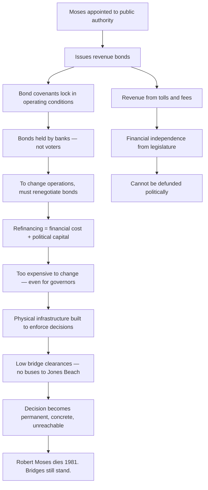
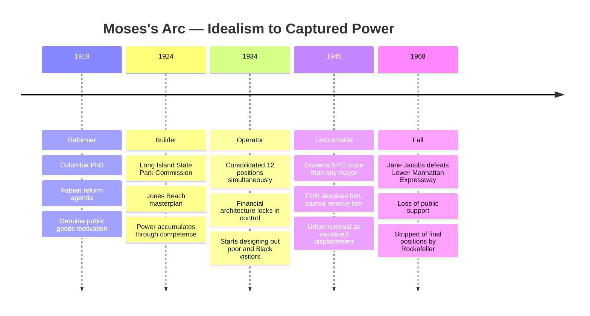

Robert Moses's bridge clearances — deliberately built too low for buses — as the canonical example of racist intent embedded in concrete, literally unreachable by future reformers. One man's aesthetic preferences and racial animus, institutionalized through bond covenants and physical infrastructure, foreclosed American urban development for a century and created car-dependent America as we know it.

## How Moses Made Himself Unaccountable

The genius of Moses's institutional architecture was that it used the appearance of technical and financial complexity to place power beyond democratic reach:

This technique — capturing institutions through financial architecture rather than political position — has been replicated in technology platforms, financial systems, and urban planning globally. The playbook: make your decisions financially load-bearing so that reversing them costs more than tolerating them.

## The Idealism Problem

Moses started as a genuine Fabian reformer. Columbia PhD, protégé of progressive governor Al Smith. His early parks work was real — he genuinely created public green space where none existed.

The idealism was always in service of his own vision rather than the people it was supposedly for. The moment actual poor people wanted to use his parks and beaches, the idealism evaporated. The 1930s: Moses designed parks and beaches for car-owning whites. No parking for buses. Changing rooms too small. Refreshment facilities inadequate. Not accidents — decisions.

The generalizable principle: **Fiercely idealistic individuals with concentrated power are particularly dangerous** because the idealism provides cover — to themselves and to observers — long past the point where it has been abandoned in practice.

## The Paul Moses Counterpoint

Paul Moses — Robert's brother — is the negative space that defines Robert. Gentle, unambitious, destroyed quietly and completely through invisible network manipulation. Paul never knew the ceiling was artificial. He attributed his career failures to his own inadequacy, not to Robert's systematic suppression.

Caro draws a straight line from how Moses treated Paul to how he eventually treated everyone: not with cruelty exactly, but with total instrumentalization. People were resources for his projects or obstacles to them. There was no third category.

The lasting lesson of *The Power Broker* is not that Robert Moses was uniquely evil. It is that power accumulated over sufficient time and through sufficient financial entrenchment does this to nearly anyone — and that the structural conditions that allowed it were not anomalies but features.
