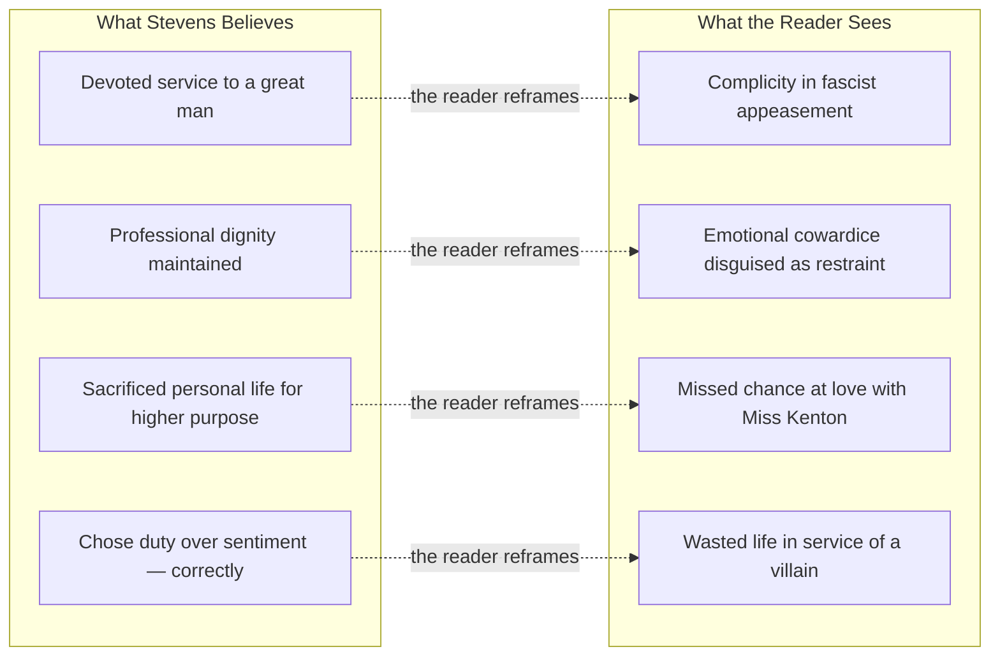

A quietly devastating novel about regret, duty, and the English butler Stevens — who has spent his life in service to a lord whose sympathies, it slowly emerges, lay with the Nazis. Ishiguro never raises his voice. The horror sneaks up on you.

The unreliable narrator is deployed with absolute precision. Stevens genuinely believes he acted with dignity; the reader can see he threw his life away.

## The Two-Track Reading

The novel operates on two simultaneous frequencies the entire time:

The reader's discomfort is that Stevens is not stupid. He is intelligent, perceptive, and entirely self-deceived. The delusion isn't a character flaw — it's a survival mechanism. Seeing clearly would require him to confront that his entire life was misapplied.

## The Dignity Trap

Stevens's obsession with "dignity" is the novel's central irony. He defines dignity as the suppression of personal feeling in service of professional role — the great butler is one who never allows the mask to slip. But this aesthetic standard was also a moral abdication. The same suppression of self that makes him an excellent butler made him complicit in Lord Darlington's meetings with Nazi officials, his dismissal of Jewish maids, his appeasement politics.

The insight generalises: institutions develop professional ethics that are really just aesthetics — rules about manner and decorum that substitute for ethical judgment. Stevens never asked whether he was serving a good man. That question was beneath the dignity of his role.

## What the Novel is Actually About

The road trip to visit Miss Kenton is ostensibly about potentially rehiring her. It is actually Stevens's one remaining chance to admit what the book has been building toward: that he chose wrong, that there was love there, that the life he did not live was the real one. He cannot say it. The English understatement — "the remains of the day" — is a phrase that contains more grief than most novels manage in three hundred pages.

Ishiguro's formal achievement: the horror of complicity, wasted life, and self-deception rendered entirely through what is not said. The reader fills the silence. That act of filling is the novel's meaning.
