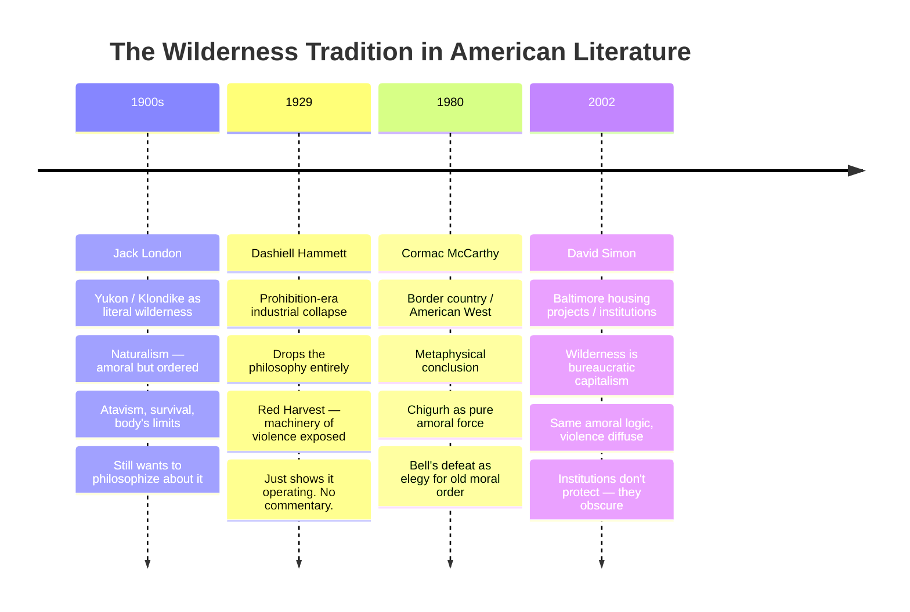
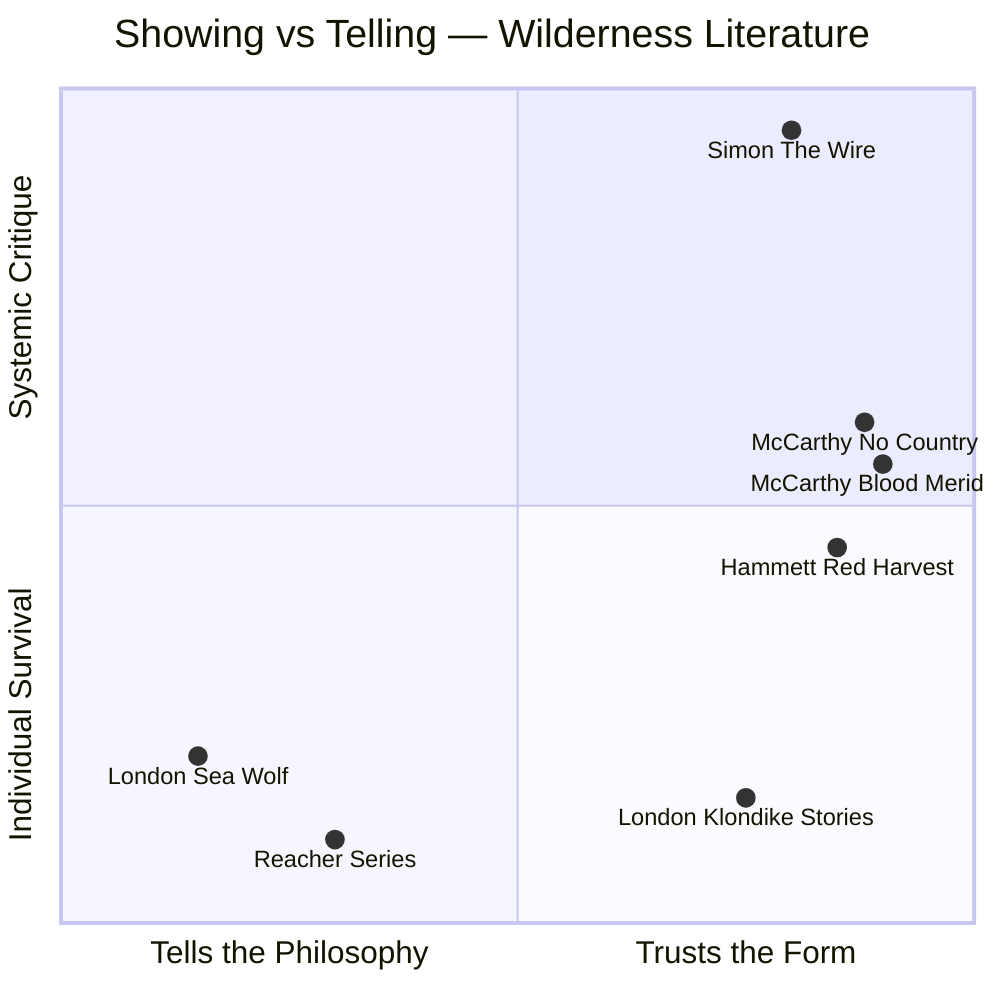

A through-line identified across London, Hammett, McCarthy, and David Simon: the wilderness (Yukon, Personville, the border, Baltimore) as a setting that strips away civilizational pretense to reveal what actually governs human behavior — violence, contingency, and self-interest, with institutions as thin veneer rather than genuine moral architecture.

## The Progression

## The Craft Distinction

The key observation is not just thematic but formal. London's best work (the Klondike stories, "To Build a Fire") trusts physical experience to carry the philosophy implicitly. *The Sea Wolf* fails because he cannot stop explaining. Wolf Larsen and Humphrey Van Weyden debate Nietzsche for chapters. The wilderness becomes a lecture hall.

Hammett, McCarthy, and Simon never explain. They show the machinery and trust the reader to reckon with it. This is the difference between literature and ideology — between the form embodying the argument and the author stating it.

## The Reacher Control Case

Lee Child packages the same wilderness logic for airport consumption but removes the cost — Reacher's competence is never genuinely tested, the violence has no reverb. The wilderness is present (small towns, corrupt local power) but there is always a just outcome, always a resolution that restores order. This is what the serious authors are refusing.

The refusal is the point. In London's best stories, the cold kills you whether or not you deserve it. In McCarthy's borderlands, evil wins. In Simon's Baltimore, the institutions eat the people who try to improve them. The wilderness test only means something if it can fail you.

The Reacher corollary: useful as a control case to understand what's actually at stake in the literature that takes the wilderness seriously.
