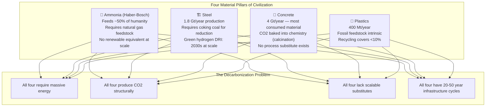
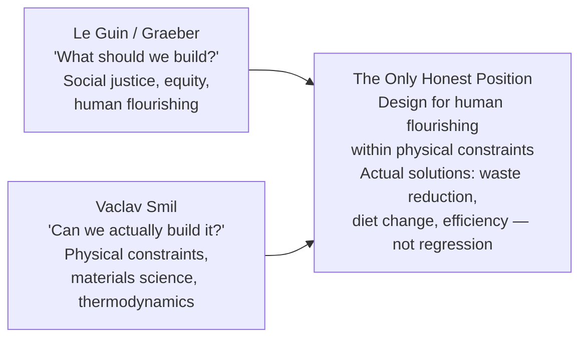

Smil as the antidote to bullshit. His relentless message across all books: energy and materials constrain everything. The four pillars of modern civilization — ammonia (Haber-Bosch), steel, concrete, plastics — all require massive energy and all produce CO2. No fast substitution exists. Decarbonisation at the pace politicians promise violates thermodynamics. Anyone claiming "100% renewable by 2030" is lying or ignorant.

## The Four Pillars

Haber-Bosch is the one most people don't know and the most important: Fritz Haber synthesized ammonia from atmospheric nitrogen in 1909. Without it, roughly half of humanity cannot be fed — the soil nitrogen required for modern crop yields simply isn't available through organic means at the required scale. No organic farming at scale replaces it. This is not a political argument against organic farming — it is arithmetic.

## What This Destroys

Smil demolishes two fantasies simultaneously, which is why he's unpopular with both camps:

| Fantasy | The Claim | Smil's Correction |
|---------|-----------|-------------------|
| **Techno-optimist** | Solar + vertical farms will feed cities | Steel/concrete for the farms, grid for the power, Haber-Bosch for the fertilizer |
| **Degrowth romantic** | Return to traditional agriculture | Supports ~4B people, not 8B |
| **Political timeline** | 100% renewable by 2030 | Primary energy transitions take 50-70 years historically |
| **EV revolution** | EVs solve transport emissions | Steel, lithium, cobalt, grid electricity — all have Smil problems |

## The Synthesis That Matters: Smil + Le Guin

Most people pick one side:
- **Techno-optimists** read Smil for what's possible and ignore social justice → efficient dystopia
- **Utopian leftists** read Le Guin / Graeber for what's just and ignore material constraints → beautiful manifestos that can't be built

The Smil methodology applied as a discipline: Start with physical constraints (thermodynamics, materials science). Calculate what's actually possible. Then assess desirability. Not the other way around. "Show me the energy budget. Show me the materials flow." This is the BS detector for any infrastructure or energy claim.

The real solutions are waste reduction (~30-40% of food produced is wasted), diet change (beef requires 20x the land of plant protein per calorie), and efficiency improvement — not romantic regression to pre-industrial agriculture and not uncritical faith in technologies that haven't been built yet.
