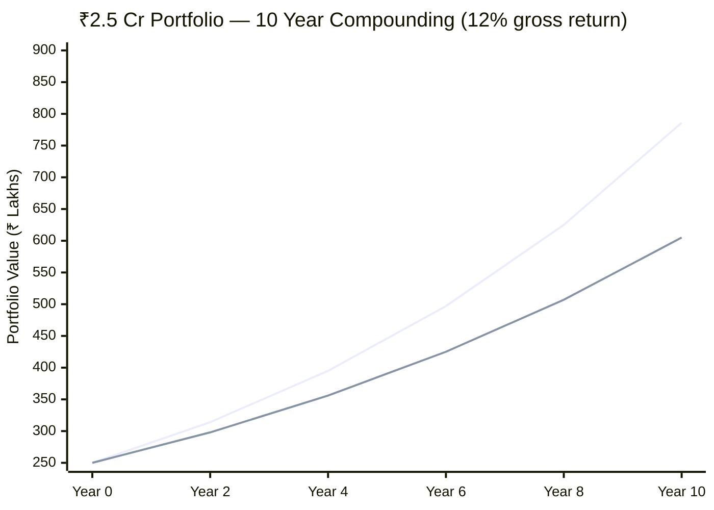
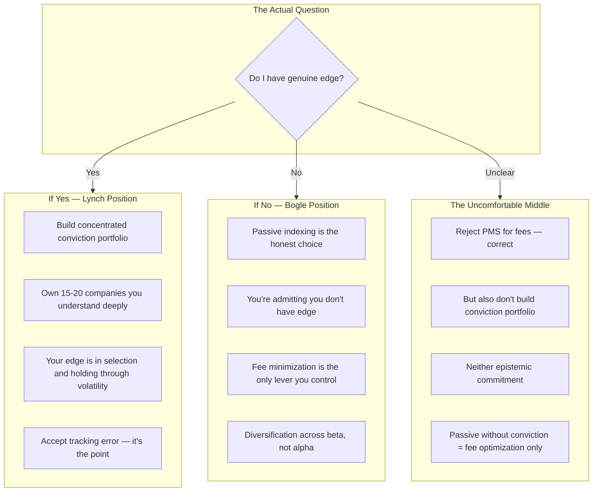

The standard Bogle vs Lynch debate applied to a specific situation: someone who rejected PMS for a 7-ETF passive portfolio. Lynch's sharpest challenge: you didn't take control, you just changed which committee decides what you own — index committee instead of fund manager. You're still delegating.

## The Fee Drag Reality

Bogle's rebuttal is mathematical and it wins:

At 12% gross market return:
- **ETF portfolio** (0.24% TER): ₹2.5 Cr → ~₹7.86 Cr over 10 years
- **PMS** (2.5% management + 20% profit share, effectively ~3.5% all-in): ₹2.5 Cr → ~₹6.05 Cr over 10 years
- **Difference**: ~₹1.8 Cr — entirely from fee drag, assuming *identical gross returns*

The PMS needs to outperform by 3-4% annually just to break even after fees. Most active managers don't over full cycles. The data in India is murkier than the US because SEBI performance disclosure requirements are weaker, but the structural math is identical.

## Lynch's Challenge — The Edge Question

Lynch's question cuts differently: If you're Chief Architect at India's largest brokerage, you have material informational edge on:
- Fintech infrastructure trajectory (which companies are winning the plumbing wars)
- Payment flow volumes (which sectors are growing before it shows in earnings)
- Regulatory changes (which rule changes benefit which players — you see the compliance burden before the market does)
- Which tech vendors are winning large contracts

Yet you're buying 500 random companies by market cap including the 247th largest smallcap you can't explain to a 10-year-old. The passive portfolio treats your informational advantage as worthless.

## The Real Distinction

These aren't equivalent strategies on a spectrum — they're different epistemic commitments. Passive indexing is a statement that you don't have edge. Stock picking is a claim that you do.

The uncomfortable middle — rejecting PMS but also not building a conviction portfolio — is neither. It's fee optimization without a theory of why the ETFs are the right ones, or why 7 of them, or why those weights. That's a PMS without the manager's beliefs, which is what an index is. But chosen without the intellectual rigor of actually committing to the passive argument.

The honest resolution: Either admit you don't have edge (full Bogle — index, minimize fees, stop thinking about it), or admit you do have edge in specific sectors and build a portfolio that expresses that belief (partial Lynch — core passive + concentrated satellite positions where you have genuine insight).
