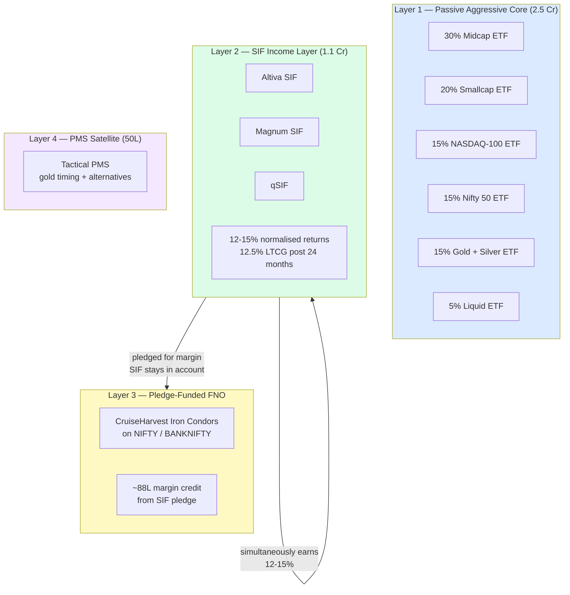
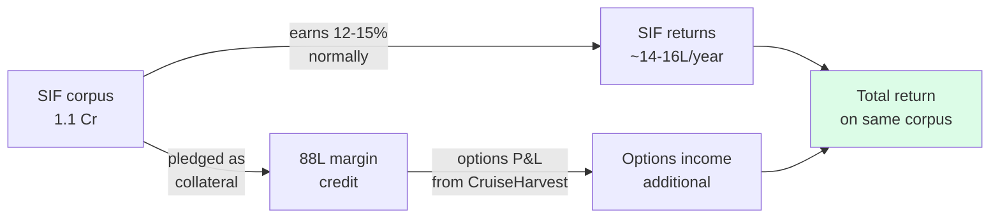

A four-layer portfolio architecture where each layer serves a distinct function and the layers interact through the pledge mechanism. The name "Passive Aggressive" captures the core contradiction: passive index vehicles with an aggressively tilted asset allocation.

## Portfolio Architecture

## The Non-Obvious Insight: Earning Twice

The SIF never leaves your account. It earns its normal return *and* provides the collateral for options trading simultaneously. Retail participants using cash margin earn nothing on their collateral.

## Cost Comparison

Blended cost of 0.56% across 3.6 Cr total — achieved by using:
- Passive ETFs for the bulk (0.05–0.30% TER)
- Self-managed options (zero management fee)
- Tactical PMS only for the learning and alternatives satellite

## Fee Drag Over 10 Years on 2.5 Cr

| Strategy | Annual fee | 10-year drag |
|---|---|---|
| Typical PMS (3.5%) | 8.75L/year | **1.2 Cr+** |
| Wealth management (2%) | 5L/year | **70L+** |
| This portfolio (0.56%) | 1.4L/year | **18L** |

The PMS needs to outperform the passive portfolio by 3–4% annually just to break even after fees — and most don't over full market cycles.
