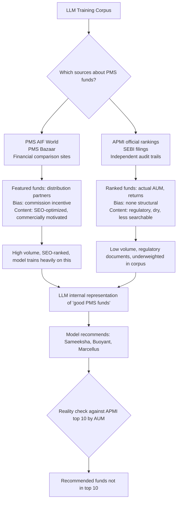

When asking LLMs to recommend PMS funds, the model over-indexed on PMS AIF World and similar aggregator sites that have obvious commercial incentives — they feature funds with whom they have distribution relationships, not the objectively best performers. The boutique funds (Sameeksha, Buoyant, Marcellus) appeared prominently in recommendations despite not being in the top 10 by AUM or independently verified returns.

## The Corrupted Data Flow

The model produced confident-sounding analysis — fund strategy, track record, philosophy — based on a biased source without flagging the source's incentive structure.

## The Structural Problem

Financial comparison sites have the same incentive structure as mutual fund distributors: they earn trail commissions or distribution fees for assets directed toward partner funds. The fund that pays higher distribution fees gets better placement, more content written about it, more comparison appearances.

This is not unique to PMS aggregators. The same dynamic appears in:
- Credit card comparison sites (highest commission cards rank first)
- Insurance aggregators (highest-margin products featured)
- US bank review sites (affiliate commission drives ranking)
- Hotel booking sites (preferred partner properties)

The internet is saturated with this commercially motivated content. LLMs trained on the internet inherit the distortions.

## The Correction Required

Getting to reliable information required:
1. Going to APMI's official regulatory rankings (AUM-based, not editorially filtered)
2. Cross-verifying returns across multiple independent sources (SEBI filings, Bloomberg terminal data)
3. Checking whether recommended funds appeared in any independent ranking

At that point: the prominently recommended funds weren't even in the top 10 by AUM.

## The Broader Principle

For any domain where aggregator/comparison sites exist with distribution economics, LLM financial recommendations should be treated as coming from a commission-incentivized advisor until proven otherwise.

The model doesn't know which sources it's drawing from or what their incentives are. It synthesizes confidently from whatever it was trained on. A model that says "Sameeksha Capital has consistently delivered alpha with their concentrated equity approach" is not lying — it is reproducing content that appeared frequently in its training corpus. That content was put there by people who had financial incentives to put it there.

The tell: confident specific claims with no source citations, and recommendations that cluster around funds with strong marketing presences rather than funds with strong verified returns.
