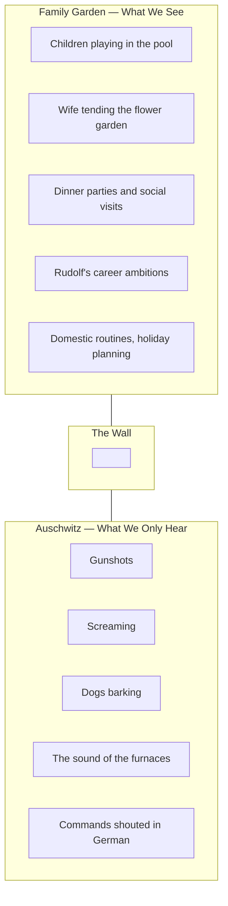

Jonathan Glazer's film shows the family of Auschwitz commandant Rudolf Höss living an ordinary, pleasant suburban life beside the camp walls. We never see inside. We only hear.

The banality is the point, and it is unbearable. One of the most formally rigorous films in years.

## The Film's Formal Architecture

The entire film operates on a single radical constraint: the camera never crosses the wall.

The wall is the film's entire argument. Ordinary life and mass murder occupy the same physical space. The same air carries both. The perpetrators have simply decided — through habit, ideology, careerism — not to hear what is always audible.

## Hannah Arendt in Cinemascope

Arendt's phrase "banality of evil" is often misread as meaning that the Nazis were ordinary people who got swept up in something — a kind of exculpatory reading. Glazer's film refuses that misreading. The Höss family is not passive. They are actively constructing their comfort. The wife is delighted with her garden. She calls it "paradise." She knows exactly what is behind the wall. She has chosen not to let it register.

The film's most disturbing scene is the most mundane: the wife trying on a fur coat stolen from a prisoner. Not dramatic. Not shocking. A woman trying on a coat and liking how it fits.

## The Sound Design as Moral Architecture

The film won the Oscar for Sound Design and it is the most important technical achievement in the film. Director of sound Johnnie Burn recorded actual industrial sounds — not amplified screams — to create the ambient soundtrack. The result is that the horror is always present but never foregrounded. It is background. It is normal. The audience is placed in the position the perpetrators occupied: aware, habituated, choosing not to look.

Glazer spent ten years making this film. It shows. There is not a wasted shot or a false note. One of the most important films about how ordinary people participate in atrocity — which is to say, one of the most important films.
