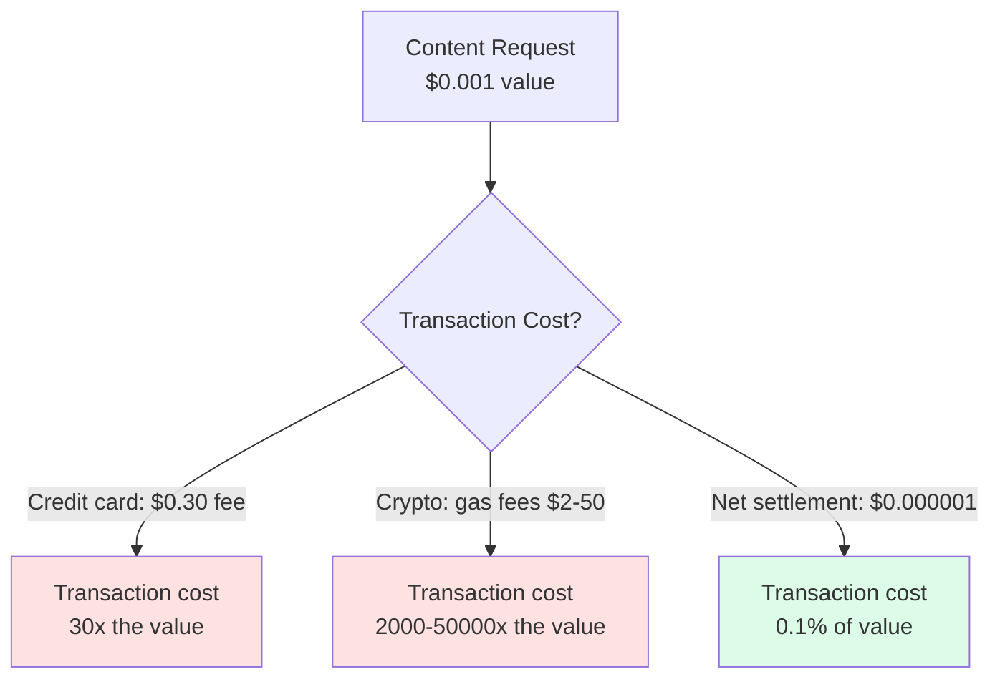
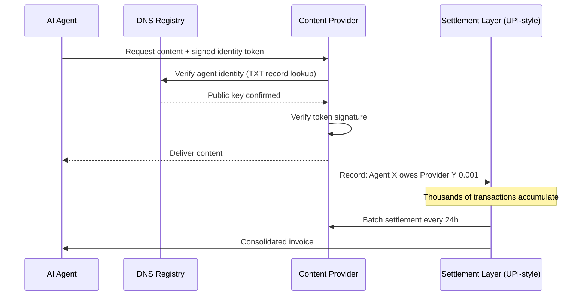
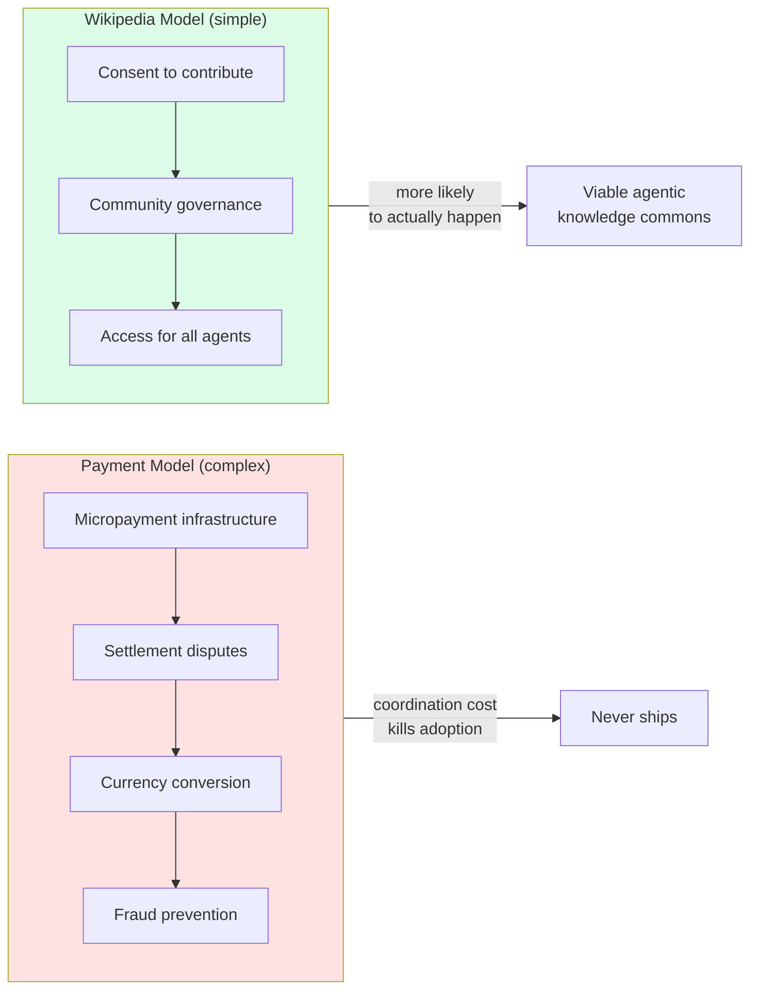

Micropayments for content retrieval have failed historically because transaction costs exceed the value of individual transactions. Agent-to-agent communication removes human friction from the payment loop, and net settlement collapses per-transaction cost to near-zero.

## Why Previous Micropayment Schemes Failed

Net settlement works the same way Visa and interbank clearing work — no actual cash changes hands per transaction. Just accounting entries, settled in batch periodically.

## The Proposed Architecture

## Why India Is the Most Likely First Mover

| Factor | India | Western markets |
|---|---|---|
| Regulator appetite for innovation | NPCI moves fast | Slow, bank-captured |
| Existing infrastructure | UPI handles 10B+ tx/month | Fragmented card rails |
| CBDC programmability | e-rupee with smart contracts | Experimental |
| Precedent | UPI AutoPay for recurring | Nothing equivalent |

NPCI has already demonstrated willingness to extend UPI for new use cases (UPI Lite, UPI 123PAY for feature phones, ONDC). An agentic micropayment extension is technically straightforward given existing infrastructure.

## The Wikipedia Alternative

The stronger argument may be: payments are unnecessary entirely.

Stripping payments removes the coordination problem that kills good ideas. Wikipedia has been running this model successfully for 25 years.
