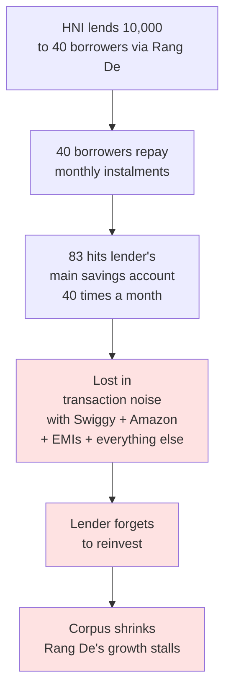
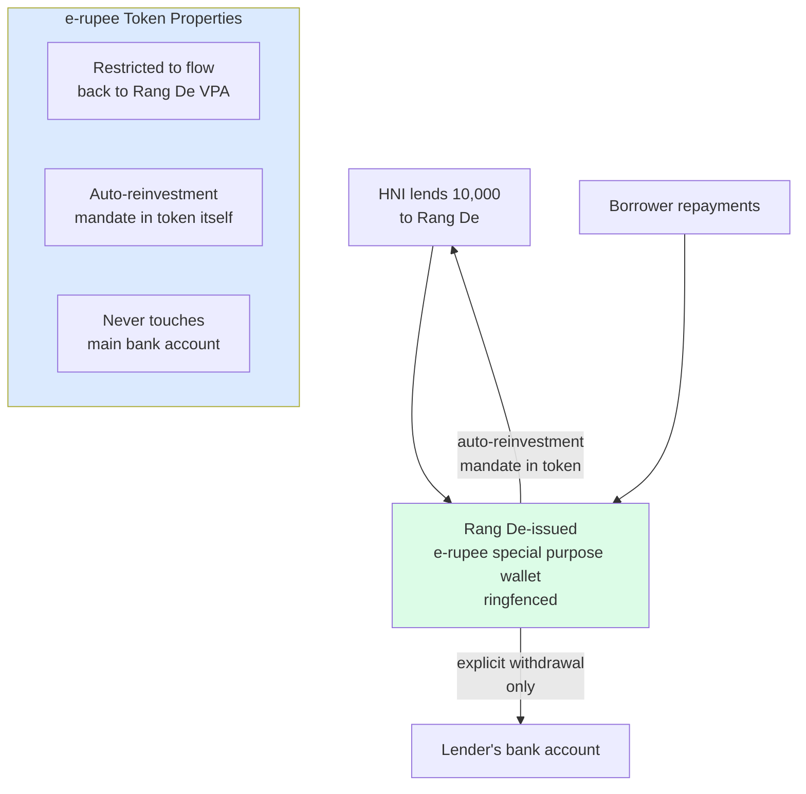
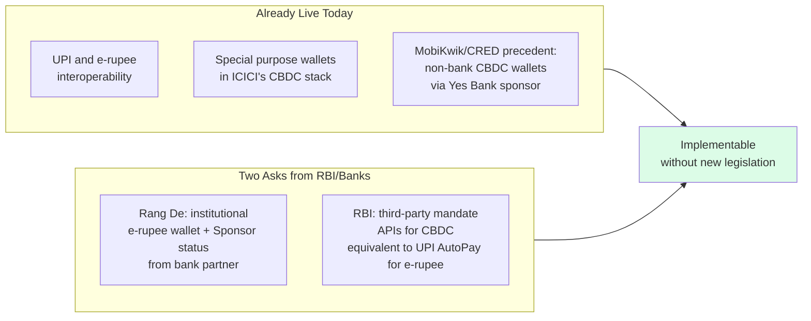

Rang De's growth bottleneck isn't regulatory — it's conversion. The problem is a UX and mental accounting problem that the e-rupee CBDC architecture can solve structurally.

## The Current Problem

The mental friction of fractional repayments landing in a general account kills reinvestment. This is not a regulatory problem or a credit problem — it's a wallet architecture problem.

## The Proposed Solution

The corpus lives separately — visible, growing, not accidentally spent on Swiggy.

## Infrastructure That Already Exists

## Why This Is Non-Trivial to See

This insight requires simultaneously knowing:
1. **Rang De's business model** — NBFC-P2P, conversion bottleneck
2. **NBFC-P2P regulatory position** — Sponsor status eligibility
3. **e-rupee programmability architecture** — token-level restrictions
4. **ICICI Sponsor framework** — who can issue constrained wallets

None of these individually suggests the others. The solution lives at their intersection.

## The Compounding Effect

A lender who reinvests automatically compounds their social impact:

| Year | Manual reinvestment | Auto-reinvesting corpus |
|---|---|---|
| 1 | 10,000 | 10,000 |
| 3 | 8,000 (leakage) | 13,310 |
| 5 | 5,000 (forgotten) | 16,105 |
| 10 | 0 (churned out) | 25,937 |

The platform's impact scales not by acquiring new lenders but by retaining existing corpus.
