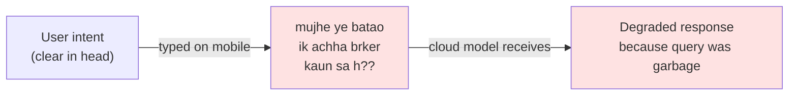
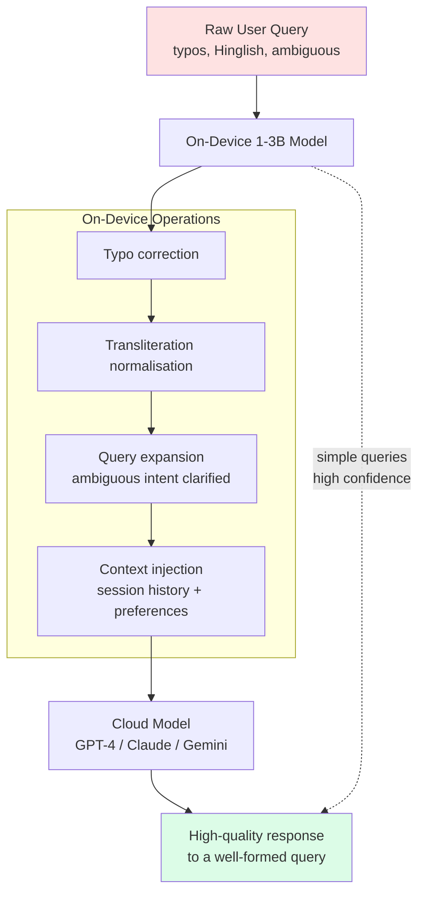
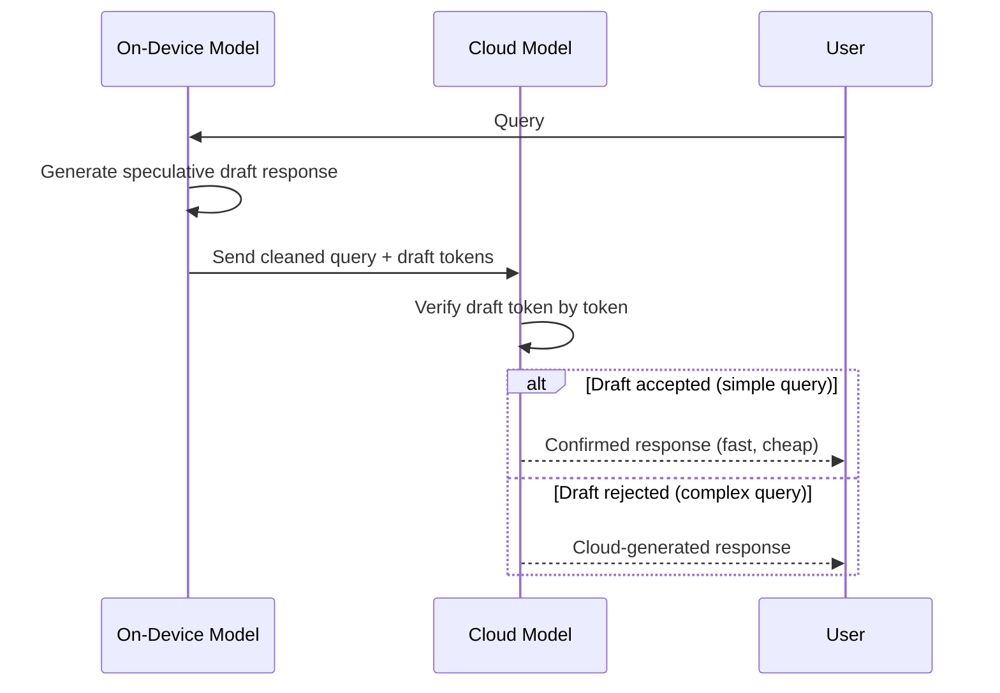
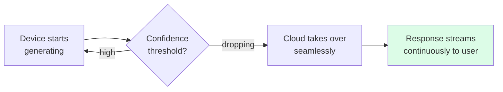

Mobile inference isn't primarily about running the full model on device — it's about using a small on-device model to improve the quality of what gets sent to the cloud model.

## The Input Quality Problem

Most real-world queries arrive degraded:

The garbage-in problem is underappreciated relative to model capability debates. A GPT-4-class model receiving a malformed query produces a GPT-4-class answer to the wrong question.

## The Preprocessing Pipeline

A 1-3B model on device can do all of this well. It doesn't need to *answer* the question — just clean and enrich the input.

## Speculative Decoding Extension

For queries the small model can handle confidently, no cloud call needed. For complex queries, the draft gives the cloud model a starting point — accept or correct token by token.

## The India-Specific Case

India is where this problem is most acute and the solution most valuable:

| Problem | Scale |
|---|---|
| Hinglish queries (Roman script Hindi) | ~500M+ users type this way |
| Code-mixed regional language queries | 22 official languages, infinite combinations |
| Transliteration ambiguity | "pyaar", "pyar", "piyar" — same word |
| Low-end device constraints | Median Android RAM: 3-4GB |

Global cloud models are optimised for English. A small on-device model fine-tuned on Indian language patterns adds disproportionate value precisely where global models fail.

## The Incremental Protocol

Rather than binary on-device vs cloud routing — a streaming protocol:

The seam is invisible to the user. Response streams continuously regardless of which model is generating at any moment.
