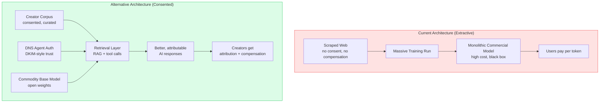
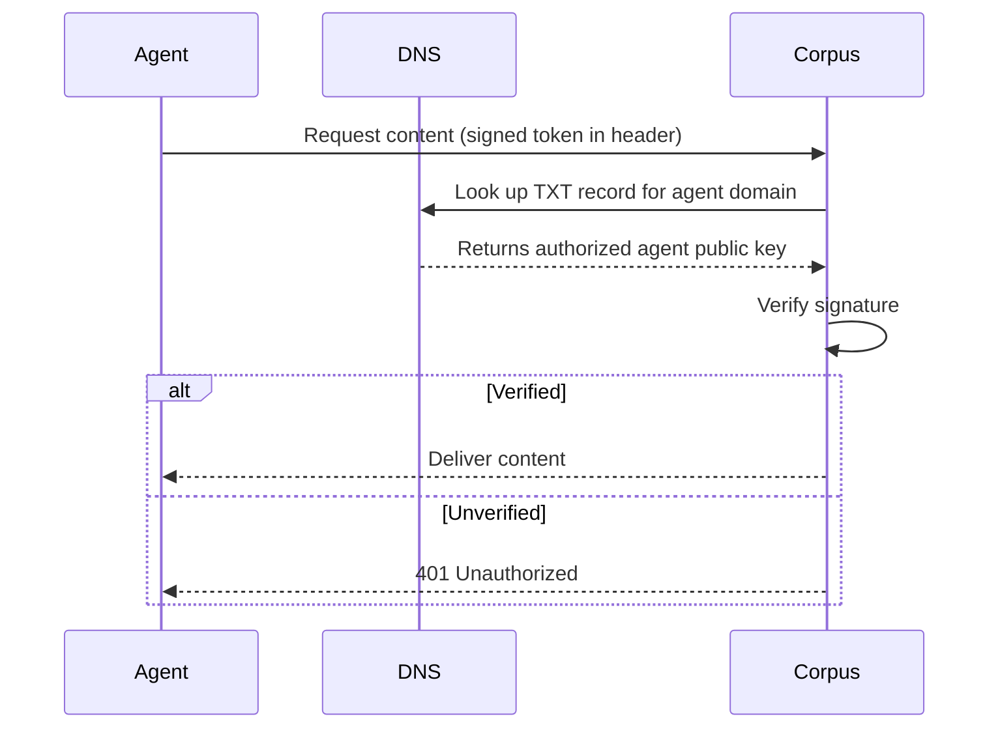

Commercial LLMs trained on creative work without consent or compensation. Indie creators — filmmakers, writers, musicians — are now walling off new content. This defensive posture, combined with a Wikipedia-style consented open corpus and DNS-based agent authentication, becomes an alternative AI knowledge architecture.

**Core insight: The creatives' defensive move becomes the foundation of a better architecture, not just a protest.**

## Current Architecture vs Proposed Alternative

## The DKIM Analogy

DNS already operates a distributed trust layer for email. The same mechanism works for agent authentication:

No new certificate authority hierarchy needed. DNS is already the distributed trust layer — it just needs a new record type (or a TXT record convention like `_agent-auth.domain.com`).

## Why Open Base + Curated Retrieval Beats Monolithic Training

| Property | Monolithic trained model | Base model + curated RAG |
|---|---|---|
| Knowledge freshness | Stale at training cutoff | Real-time retrieval |
| Attribution | Impossible | Built-in (source tracked) |
| Creator compensation | None | Per-retrieval micropayment possible |
| Quality of corpus | SEO slop + synthetic content | Curated, consented, high-signal |
| Cost to update | Retrain ($millions) | Update corpus index ($cheap) |

The "we need the whole internet to train" claim conflates language competence (base model job) with domain knowledge (retrieval job). These are separable problems.

## The Business Model

Creators opt in to a consented corpus. Each retrieval credits the source. Net settlement handles micropayments without per-transaction friction. The Wikipedia governance model handles curation without payment infrastructure — potentially more robust than any payment scheme.
