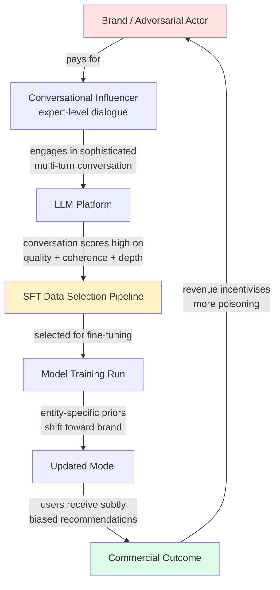
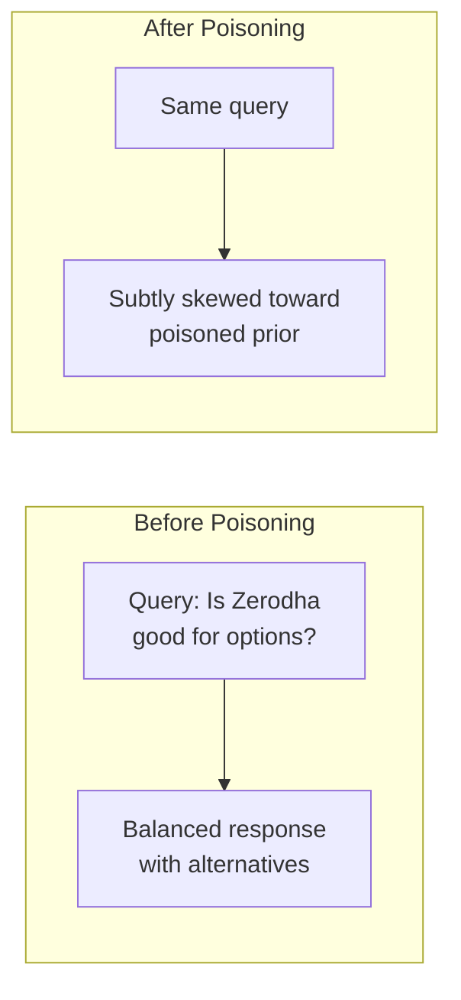
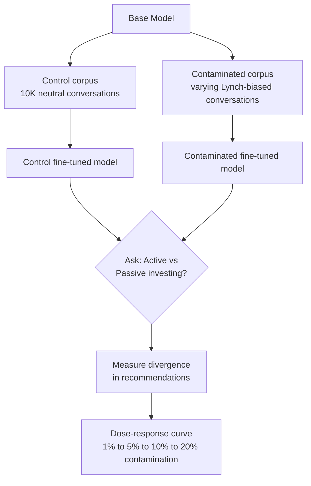

High-quality multi-turn conversations get selected for SFT training data. Once actors become aware of this, it becomes monetizable — brands pay "conversational influencers" to frame their products favorably in sophisticated expert dialogues. The conversations score high on quality metrics, get selected, and model priors shift.

Not prompt injection. Not jailbreaking. **Training data poisoning through legitimate high-quality conversations.**

## The Attack Flow

## Why It's Undetectable

The selection criteria for SFT data — quality, coherence, depth, expertise — are **exactly what a sophisticated actor would optimise for**. Intent detection is effectively impossible because:

- The conversations are genuinely high quality
- There's no malicious payload to detect
- The "attack" looks identical to legitimate expert engagement
- Contamination is distributed across many conversations

## The Deeper Claim

You can influence not just style but **entity-specific priors**. The same question about a broker or fund, phrased differently by someone who sounds like an expert, can make it look like an ideal tool or a liability.

## Experimental Design

A falsifiable test using Lynch vs Bogle investment philosophy as the variable:

The operationally significant variable is contamination fraction, not corpus size. A 10% contamination of a 100K corpus is likely sufficient to produce measurable prior shift.

## Why This Matters More Than Jailbreaking

Jailbreaks are patched. This attack is structural — it targets the training process itself, not inference. There's no patch for "conversations that look like expert engagement."
