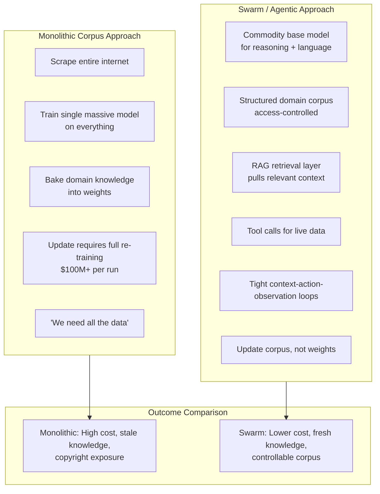
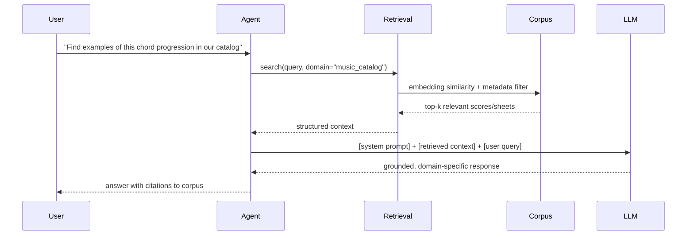

The "we need the whole internet to train" claim may be a myth waiting to be broken. Base model handles language competence and reasoning structure. Niche SFTs — or more precisely, RAG + tool calls + tight agentic loops — handle domain knowledge. No fine-tuning required for most specialist use cases.

## The Architecture Comparison

## The Claude Code Insight That Generalises

The effectiveness of Claude Code comes from tight context-action-observation loops feeding precise context — file contents, error messages, terminal output — not from baking more coding knowledge into weights. The model knows code because it was trained on code. But what makes it effective at your specific codebase is the retrieval + observation architecture.

The knowledge retrieval problem and the reasoning problem got conflated because early RAG was crude. When RAG produced bad results, people concluded that domain knowledge needed to be in weights. The correct conclusion was that retrieval needed to be better. With modern retrieval (hybrid sparse/dense search, reranking, structured context), the knowledge can live outside the model and be kept fresh and access-controlled.

## The Indie Creative Community Implication

This is the most practically important implication. An indie film composer, a fiction community, a niche research group — none of them need to train anything. They need:

1. A well-structured, access-controlled corpus of their work and domain knowledge
2. A retrieval layer (embeddings + search)
3. A commodity base model with a sensible system prompt

The result: a model that knows their domain, respects their rights (because the corpus is theirs), and stays current as they add to it. The cost is a few hundred dollars a month, not $100M.

The "training on your data" framing that AI companies sell is mostly unnecessary for most specialist use cases. It's also a rights exposure risk — training embeds your data into shared weights. RAG keeps your data yours.

The rights remain with the corpus owner. The model does not accumulate their knowledge into weights shared with other users. The corpus can be updated without retraining. This is the architecture that makes sense for creative communities protecting their work.
