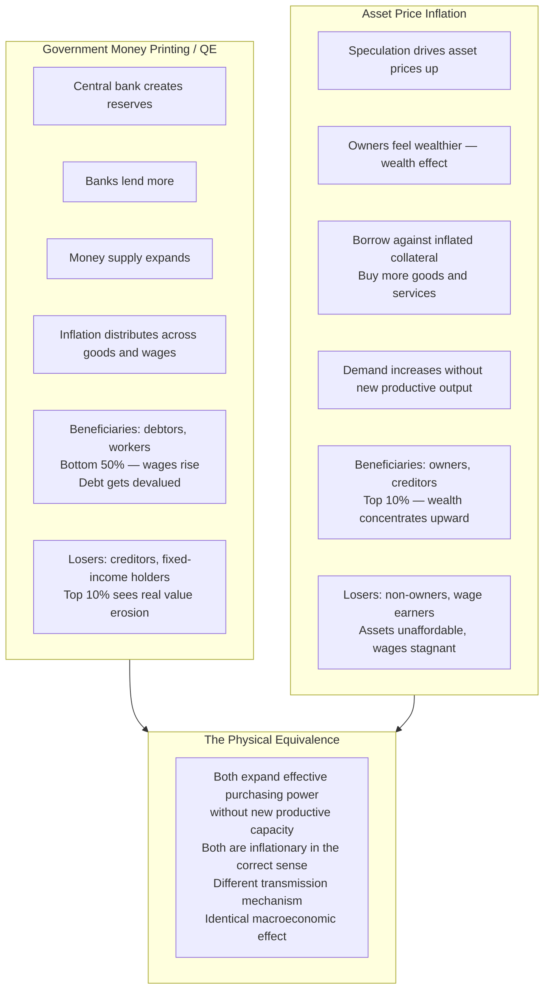

The observation: Tesla stock inflating from $200 to $400 on robotaxi fantasies is functionally identical to government money printing. Owners feel wealthier, borrow against inflated collateral, spend more, chase the same goods — demand increases without corresponding productive output. Money supply effectively expands. The mechanisms are identical.

## Two Mechanisms, Same Effect, Different Beneficiaries

## The Historical Evidence

The "sound money" crowd owns assets. They celebrate the mechanism that enriches them and condemn the mechanism that enriches others, framing both positions as economic principle rather than class interest.

| Period | Mechanism | Who benefited | "Sound money" crowd's position |
|--------|-----------|---------------|-------------------------------|
| 1970s | Wage-price spiral / government printing | Workers, debtors | Fund Volcker's brutal rate hikes. Stop the printing. |
| 2010-2021 | QE → asset price explosion, stagnant wages | Asset owners | Call for more easing. Assets need support. |

Same monetary dynamics. Opposite reactions. The difference was who benefited.

## The Austrian School Tell

Developed by Ludwig von Mises and Friedrich Hayek — aristocrats in post-WWI Austria horrified by social democracy. The economics was reverse-engineered to justify their class position:

- **"Hard money" / deflationary policy**: Helps creditors (their real wealth increases), hurts debtors (their debt burden increases in real terms)
- **"Government spending causes inflation"**: True when it flows to wages; less loudly stated when it flows to asset holders via QE
- **"Spontaneous order of markets"**: Markets that happen to have allocated significant wealth to people who were already wealthy

The sophisticated argument: The Austrian framework has genuine analytical content about price signals and economic calculation. That content was developed by people who stood to benefit from its policy conclusions. This doesn't make it wrong — but it should be read knowing where it came from.

## The Novel Formulation

Not the political economy analysis (which has precedent in Piketty, Graeber, Kalecki): the specific formulation — Tesla at $400 on robotaxi speculation as functionally equivalent money printing, just with a different distribution mechanism — is unusually clean. The equivalence is obvious once stated but rarely stated this way.

The standard critique of QE focuses on where the money goes (financial assets, not Main Street). The standard critique of asset bubbles focuses on systemic risk. This framing focuses on the monetary equivalence: both expand purchasing power relative to productive capacity. One is called inflation. The other is called wealth creation.
