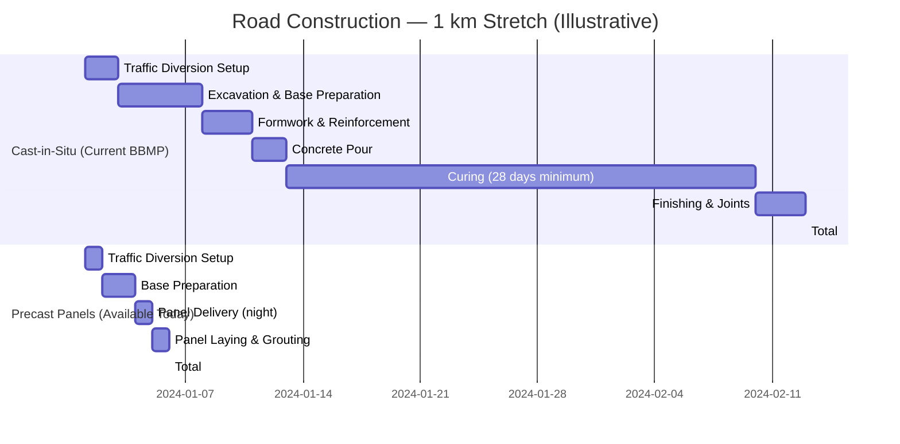
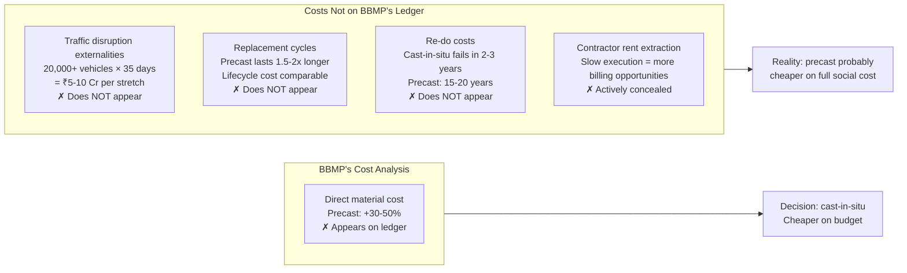

White-topping roads in Bangalore takes 30-45 days per km. Precast concrete panels — factory-cured, trucked in at night, laid like tiles, grouted — achieve 3-5 days per km. The technology exists. L&T and Fuji Silvertech already do precast for metros and expressways in Bangalore. The application to municipal roads is missing.

## The Speed Comparison

The technology is not experimental. Factory-cured panels have controlled mix ratios, consistent water-cement ratio, and proper curing time (28 days in the factory, not on the road). The panels arrive at the site ready. This eliminates the primary failure mode of Bangalore's cast-in-situ work: rain during curing, wrong mix in the field, night-shift shortcuts.

## Why BBMP Won't Do It

The cost framing that kills it: BBMP sees 30-50% higher direct material cost for precast and stops there. What doesn't appear in their analysis:

## The Governance Failure Structure

Why Bangalore won't adopt precast is a case study in how infrastructure decisions get made:

- **No precast capacity nearby**: Contractors won't invest in precast infrastructure if BBMP won't contract for it. BBMP won't contract for it until capacity exists. Classic coordination failure.
- **BBMP tender documents mandate cast-in-situ**: Specification documents were written when cast-in-situ was the only option. No one has updated them. Contractors bid to spec.
- **Contractor incentives reward slow execution**: Paid on milestone completion, not time. Liquidated damages for delay not enforced. Fast execution is not in the contractor's interest.
- **Political credit structure**: Who gets credit for less disruption? Disruption avoidance is invisible. Ribbon-cutting on a new road is visible. The incentive is to build, not to build efficiently.

The daily commute pain is not an engineering constraint. It's a governance failure dressed as one.

## The Broader Frame

India's infrastructure plumbing — precast standardization, logistics, specification reform — is not addressable by "deeptech" and not demo-able to VCs. The real bottleneck is boring standards harmonization: BBMP updating its specification documents to allow precast bidding. That change would trigger a supply response. Within two years, precast manufacturers would cluster near Bangalore. Within five years, prices would fall to parity.

The 100 km/day highway ambition would be more achievable with precast/prefab than with faster concrete pouring. But precast highways require precast yards every 50km, logistics coordination, and standardized panel designs — all of which require government specifications to drive market response. The government that can't update BBMP road specs probably can't coordinate national precast standardization either. Which is the whole problem.
