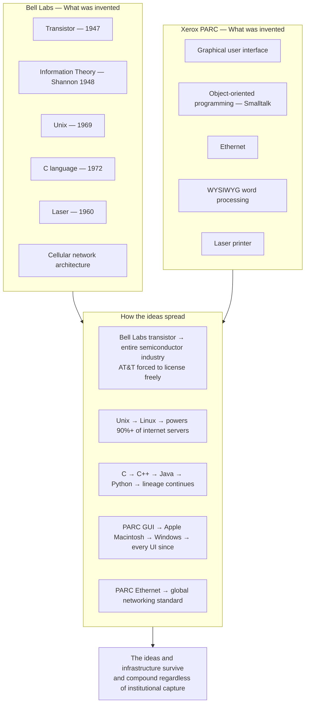
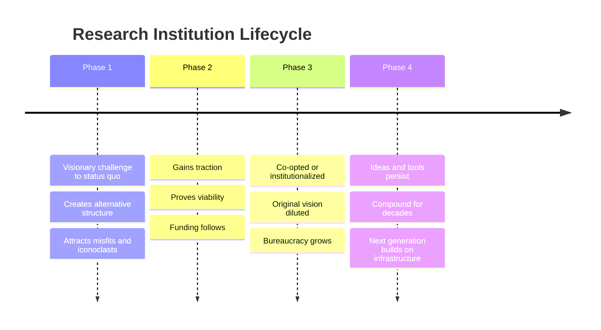

The standard "Xerox fumbled commercialisation" framing misses the point entirely. The ideas diffused anyway — enabled Apple, Microsoft, and the entire PC revolution. Bell Labs: transistor, laser, Unix, C, information theory, cellular networks. Even after AT&T's breakup, the spillover sustained innovation for decades. The model influenced every modern research lab.

## The Diffusion Pattern

The real question is not "did PARC commercialize well?" The ideas escaped. Xerox's failure was structural — the organisation couldn't route PARC's output to Xerox products. But the output reached the world anyway through talent diffusion (Jobs's visit), publication, and later hiring.

## The Pattern Across Successful Research Institutions

You don't need perfect institutions. You need institutions that move the needle forward and leave infrastructure for the next generation.

Bell Labs was captured by AT&T's commercial interests — research was increasingly directed toward things AT&T could patent and monetize. Unix escaped anyway, via the universities that AT&T licensed it to cheaply (thinking it was academic). PARC's ideas were appropriated by Apple after Jobs's famous visit. The GUI survived and diffused globally. Stallman and the FSF were opposed by every major corporation. Linux now runs most of the world's servers.

## The Three PARC Failure Modes

The PARC failure was specific and avoidable:

1. **Too far ahead of hardware**: Smalltalk required machines that didn't exist at affordable prices. The software was ready; the supporting infrastructure wasn't. Timing matters as much as quality.

2. **No internal commercialization path**: Research → product pipelines require dedicated translation work. PARC had none. The researchers published; no one at Xerox had the mandate to turn publications into products.

3. **Parent company's interests misaligned**: Xerox's copier revenue stream was threatened by personal computing (people with PCs wouldn't need to print as much). PARC was researching the technology that would eventually eat Xerox's business. The institutional incentive was to delay rather than accelerate.

## The India-Specific Implication

The Bell Labs / PARC model — sustained funding for basic research with application links — built on capability infrastructure for underserved populations rather than corporate profit or academic metrics.

The organising principle changes everything: which problems get selected (not "what can we patent" but "what constraint, if removed, multiplies human capability"), how success is measured (not citation counts or patents but adoption at scale), what kinds of researchers are attracted (practitioners with domain credibility, not just academic credentials).

The failure modes to explicitly design against: building capabilities that require infrastructure that doesn't exist yet (PARC timing problem); no path from research to deployment (PARC structure problem); research agenda captured by funder's commercial interests (Bell Labs late-period problem). Each is avoidable with deliberate institutional design.
