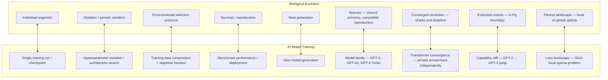

The application of evolutionary biology concepts — mutation, selection pressure, fitness landscape, speciation, extinction — to successive generations of AI model training. Each training run as a generation. Corpus selection pressure as environmental pressure. Model families as species. Capability cliffs as extinction events. Convergent evolution explaining why different labs independently arrive at transformer architectures.

## The Mapping

## The Generative Implication

The most useful part of the analogy is not descriptive but prescriptive. Biological evolution has spent billions of years solving the local optima problem. The solutions it found:

**Sexual recombination**: Two parents combine chromosomes, creating offspring that jumbles genetic information. This breaks symmetry — the offspring isn't just a slightly mutated version of either parent. In AI terms: combining representations from two differently-trained models might escape local minima that neither could escape alone.

**Punctuated equilibrium**: Evolution doesn't proceed smoothly. Long periods of stasis punctuated by rapid change during environmental stress. The analogy: capability jumps in LLMs appear discontinuous, not gradual. This may not be surprising — it may be the expected dynamics of complex fitness landscapes.

**Genetic drift**: In small populations, random variation can fix neutral or even slightly deleterious traits just by chance. In AI: smaller compute budgets force architectural choices that wouldn't be made at scale. Some of these might accidentally explore more useful regions of the architecture space.

## Limits of the Analogy

Evolution has no foresight. Neither does gradient descent. Both are hill-climbing algorithms that can get trapped. But evolution operates on populations over generations with genuine diversity. Training a model is optimizing a single trajectory.

The analogy breaks down here: a species has millions of organisms exploring the fitness landscape in parallel. A training run is one organism running a deterministic (or near-deterministic) path. The diversity that makes evolution powerful has to be deliberately introduced through ensemble methods, architecture search, or model merging — it doesn't emerge naturally from the training process.

The frame is still useful for thinking about training dynamics and capability emergence, even where it doesn't map precisely.
