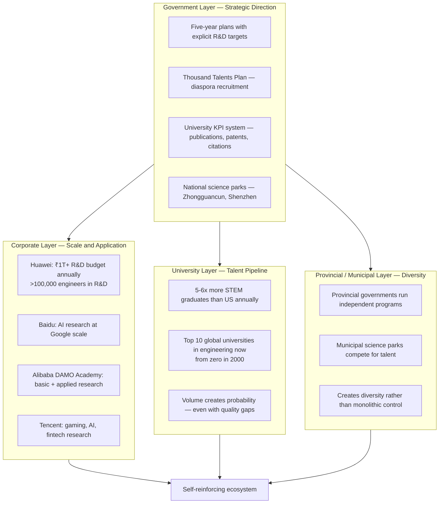
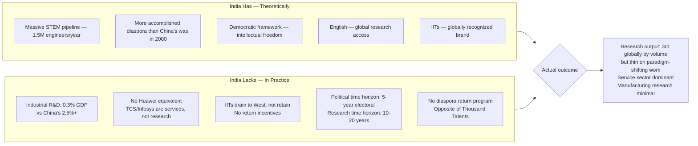

China's research transformation is a hybrid model that defies the simple "government-driven" narrative. The government provides strategic direction and aligned incentives; the bottom-up energy is genuinely entrepreneurial. The genius is in the architecture that aligns individual researcher incentives with national priorities without complete central control.

## The Architecture

## What Actually Worked vs What Failed

| Mechanism | What it did | Where it works | Where it fails |
|-----------|-------------|----------------|----------------|
| Thousand Talents | Recruited diaspora scientists, reversed brain drain | Experienced researchers as force multipliers | Geopolitical blowback, US prosecution |
| University KPIs | Created scale — volume creates breakthrough probability | Engineering, incremental improvement | Perverse incentives, paper mills, fraud |
| Corporate R&D | Scale impossible in academia | Applied research, engineering-heavy domains | Basic science, paradigm-shifting work |
| Provincial programs | Diversity, local adaptation | Niche applications, regional industries | Coordination failures, duplication |

The structural advantages money alone doesn't buy: ability to conduct large-scale studies (data collection, clinical trials, infrastructure experiments) impossible in liberal democracies. Dense industrial ecosystems where research translates to manufacturing in months rather than years.

## The India Contrast

The India gap is not talent — it is industrial R&D investment and diaspora retention architecture. India produces the researchers. China kept them (or brought them back). India exported them.

The single most tractable intervention: an Indian equivalent of the Thousand Talents program — competitive packages, tax incentives, research infrastructure — targeting the Indian diaspora in US/UK AI and biotech labs. The pipeline is there. The pull mechanism is not.
