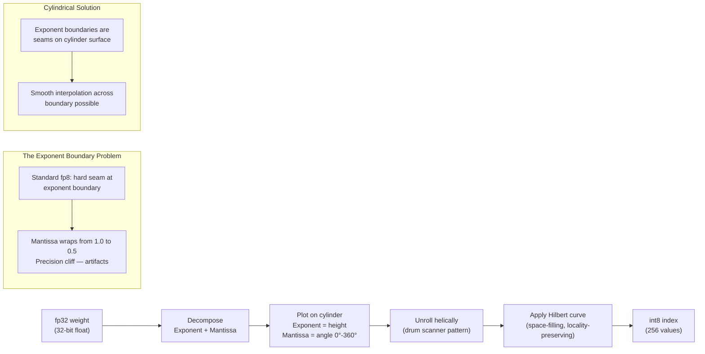

Floating point weight quantization reframed geometrically. Take exponent and mantissa as two dimensions, plot on a cylinder (exponent = height, mantissa = angle around the circumference), then unroll helically to an int8 line. The drum scanner analogy — a photocopier drum serializes a 2D surface to a 1D scan via helix — is the physical intuition.

## The Geometric Pipeline

## Why Exponent Boundaries Matter

In standard IEEE floating point, when the exponent increments, the mantissa resets to zero. This creates a hard precision cliff: values just below the boundary have different relative precision than values just above it. In standard quantization (linear or log-scale), these boundaries become artifacts — small errors in quantized representation are amplified near boundary crossings.

The cylindrical framing makes this visible: the boundary is a seam where the mantissa "wraps around" the circumference of the cylinder. A smooth helical embedding could interpolate across that seam rather than snapping hard at the boundary, potentially reducing quantization error at these critical points.

## The Hilbert Curve Step

The Hilbert curve is a space-filling curve that maps a 2D square to a 1D line while preserving locality — points that are nearby in 2D remain nearby in 1D. Applied to the cylindrical surface (after unrolling), it provides an int8 encoding where similar floating-point values cluster near each other in the quantized space.

This is important because quantization error is proportional to the distance between the original value and its nearest quantized neighbor. Locality-preserving mappings minimize worst-case distance, which means lower maximum quantization error even with 8-bit indices.

## Status and Honesty

This specific composition — cylinder + Hilbert curve for floating point quantization — appears unpublished in the quantization literature. Related techniques exist:
- **QuIP/SpinQuant**: rotation-based quantization (random orthogonal transforms before quantization)
- **Standard log quantization**: addresses the exponent problem differently
- **VQ-VAE / neural codecs**: vector quantization with learned codebooks

The geometrically novel framing is real. Whether it yields practical improvement over these existing techniques is unverified — that would require implementation and benchmarking against standard quantization baselines (GPTQ, AWQ, etc.) on real model weights.

Worth a literature search in the neural codec and VQ-VAE space. If the Hilbert curve + cylindrical decomposition hasn't been tried, the experiment is tractable: implement as a drop-in quantization scheme, benchmark on a standard model, measure perplexity vs bit-width tradeoff against GPTQ baseline.
