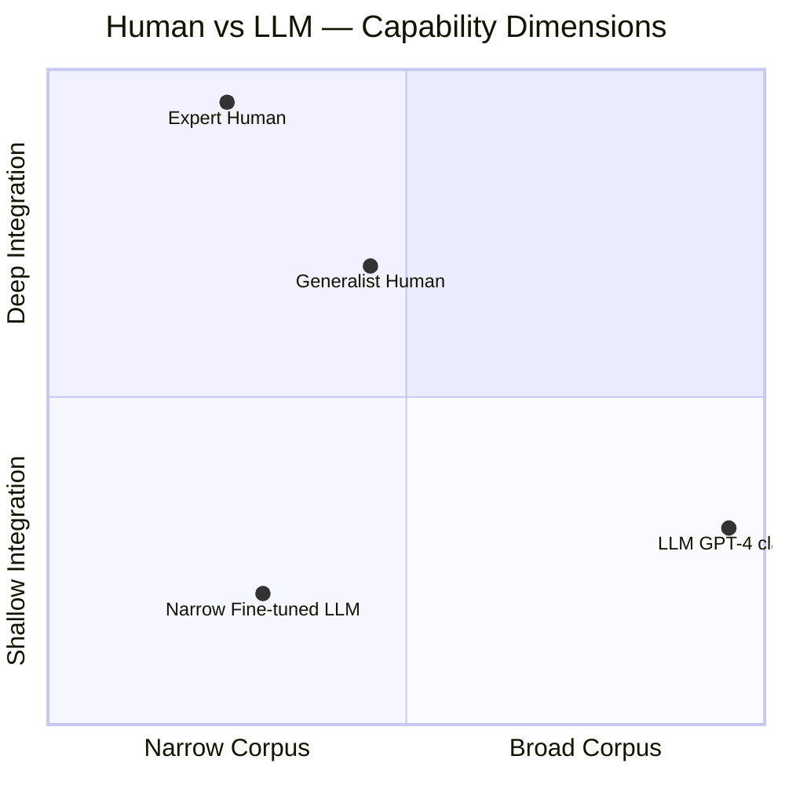
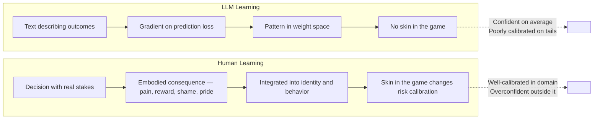

A human with voracious multi-domain reading converges on similar answers to LLMs on well-posed problems — not because of inferior reasoning but because convergent optimization on high-quality diverse inputs tends toward similar local optima regardless of substrate. The "S" in SLM is for Small — narrower corpus than an LLM but with a dimension of depth (lived experience, embodied feedback loops, skin in the game) that text-trained models can only approximate.

## The Comparison

The axes matter: LLMs have read vastly more text than any human. But reading is not the same as integration. A human who has run a business, navigated a medical crisis, raised a child, and worked in three industries has not just read about these things — they have been reshaped by them. The model has patterns. The human has scar tissue.

## The Interesting Asymmetry

Humans can improve upon every LLM suggestion because active learning with immediate feedback loops isn't just pattern matching — it's gradient descent on the real world. When the human's decision has consequences, the feedback is rich, immediate, and embodied. The model's training signal was text describing consequences, which is not the same thing.

## The Practical Upshot

The human-as-SLM framing is useful because it reframes the human-AI collaboration correctly. The model is not a more knowledgeable version of the human. It is a different kind of system with different failure modes.

LLM failures: overconfident in rare situations, unable to update priors mid-conversation on the basis of experience, no calibrated uncertainty in genuinely novel domains, no embodied understanding of stakes.

Human failures: narrow corpus relative to LLM, availability bias (overweighting recent and vivid experiences), motivated reasoning, cognitive load limits.

The optimal combination: Use the LLM for breadth, pattern recognition, and synthesis across domains the human hasn't deeply studied. Use the human for calibrated judgment on high-stakes decisions in domains where embodied experience matters. Neither alone is sufficient. The mistake is substituting one for the other rather than composing them.
