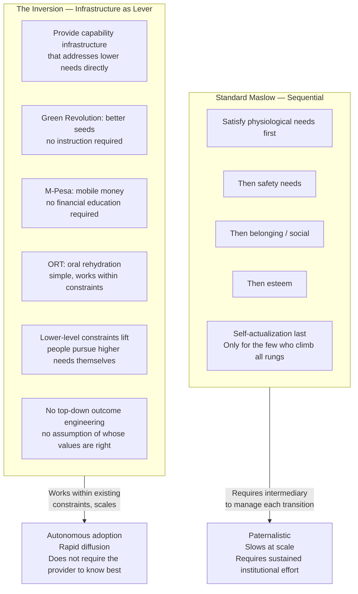

The standard Maslow reading: satisfy lower needs before pursuing higher ones. The inversion: providing capability infrastructure that addresses lower needs frees people to pursue higher ones without the provider needing to engineer outcomes.

## The Inversion

## Historical Precedents That Work

The pattern across successful capability infrastructure:

| Intervention | What it provided | What it did NOT require | Outcome |
|-------------|------------------|------------------------|---------|
| Green Revolution (1960s) | High-yield seed varieties | Farmers to adopt new philosophy or education | ~1B people lifted from hunger risk |
| M-Pesa (Kenya, 2007) | Mobile money transfer | Financial literacy education | 40%+ of Kenya's GDP flows through it |
| Oral Rehydration Therapy | Salt-sugar-water formula | Medical infrastructure or understanding of pathophysiology | Saved 50M+ lives in 40 years |
| Smallpox vaccine | Immunity | Understanding of immunology | Disease eradicated globally |

Pattern: capability infrastructure working within constraints → adoption → condition improvement → capability expansion. The lever works without the provider needing to engineer the beneficiary's values or outcomes.

The contrast cases fail because they violate the pattern: microfinance without market access doesn't work (capital without the capability to deploy it). Laptop programs without power or connectivity don't work (device without the infrastructure). Literacy without economic opportunity doesn't work (capability without a use case).

## The Thought Experiment

Today's world has a top 5-10% living comfortably by extracting from the remaining 90%. What if exceptional capability created obligation rather than extraction rights?

Capability as structural obligation rather than privilege. Practical mechanisms:
- **Differential local taxation**: Direct feedback loop between local inequality and local obligation. The more unequal your immediate context, the higher the obligation. Not national-level redistribution — neighborhood-level.
- **Non-transferable, non-inheritable social credit**: Capability creates non-fungible obligation. Cannot be sold, inherited, or transferred. Expires with the person.

The distinction from eugenics: self-actualization is a developmental process, not an inherited trait. The capacity exists in all humans — the question is what conditions enable or suppress it. The obligation model targets conditions, not people.

## The India IT Generation Problem

The cohort that benefited from subsidized engineering education, public infrastructure, and the Bangalore ecosystem now sends children to private schools, uses private hospitals, and is largely silent on rebuilding the enabling infrastructure at scale.

This is not malice. It is rational individual behavior: private options are now better, and the public system is degraded enough that rebuilding it feels like a losing bet. The result: the political constituency for rebuilding public capability infrastructure is weakest precisely among those who most viscerally understand its value. The people who know what IIT admissions and public engineering colleges did for them are opting out of the system that made them.

The inversion applies here: what is the capability infrastructure that, if provided, would rebuild the constituency? Not moral argument (which never works). Not tax policy (which is reversible and resisted). Infrastructure that is so obviously valuable that the beneficiaries' children use it again — which creates the political constituency for maintaining it.
