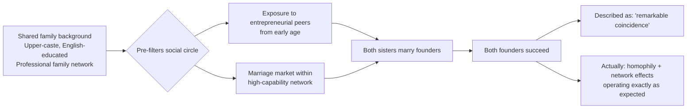
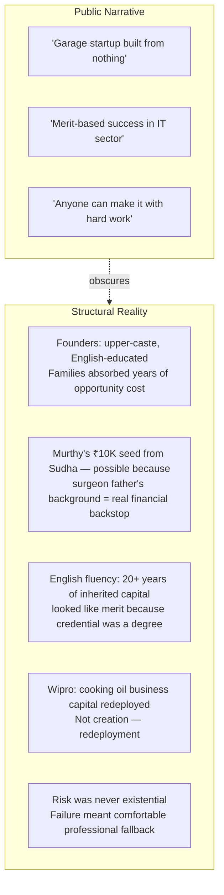

Siblings as the natural control group for the merit vs privilege question — same household, same early environment, same parental inputs, divergent paths and convergent outcomes. The two-brothers case: both reaching senior architect/director level in Bangalore's tech ecosystem, different domains, similar career arcs. What's shared (access, timing, Bangalore ecosystem) vs what's individual (domain choices, compounding decisions) is almost impossible to cleanly separate.

## The Homophily Argument

The two sisters observation is the sharper claim. The probability that two sisters both marry entrepreneurs who become billionaires — Murthy and Deshpande in this case — is statistically near-impossible without a common social network pre-filtering for a very specific type of person. That's not coincidence, it's homophily. The network finds itself.

The "remarkable luck" is actually the network doing exactly what networks do. The surprise is not that it happened — it is that people are surprised by it.

## The IT Meritocracy Myth

The asymmetry that's never named: Risk was never existential for any of them. Failure meant returning to a comfortable professional life. That limited-downside, unlimited-upside structure is the actual entrepreneurial privilege. The genuine rarity — worth studying — is first-generation wealth creation from OBC/SC/ST backgrounds without business networks. They exist but face structural headwinds: no credit, no network, no buffer, social stigma on failure.

## The Language Capture

"Hard work" applied to cognitive desk work while physical labor is called "unskilled" — simultaneously elevating one and erasing the other. Road-laying requires enormous embodied knowledge and physical skill. It just doesn't convert to capital.

What's being rewarded is leveraged work — work that scales, work that can be owned, work that compounds. The reward differential has nothing to do with effort and everything to do with who captures the value.

The India-specific layer: Caste historically assigned which bodies did which work. Economic modernization didn't dismantle that mapping — educational credentials became a laundering mechanism producing the same sorting with a meritocratic veneer. The IIT graduate's upper-caste overrepresentation is not primarily explained by differential intelligence — it is explained by generations of differential access to the preparation infrastructure that IIT entrance requires.
