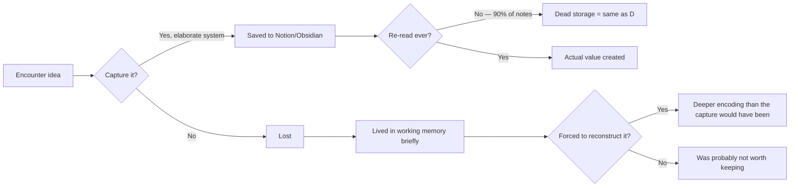

The value of a note is not in the capturing but in the returning. Most note-taking systems are elaborate ways to avoid thinking.

A note that you never re-read is a thought that you flushed with extra steps. Write less, revisit more.

## The Capture Trap

There is a specific kind of productivity theater where capturing a thought feels like processing it. Highlight the passage. Save the article. Tag it in Notion. Add it to the reading list. The actions feel meaningful because they resemble intellectual work. They are not intellectual work.

The uncomfortable implication: forgetting is often more efficient than capturing. The ideas worth keeping tend to return. The ones that don't return may not have been worth the storage overhead.

## What Actually Works

The useful function of a note is not preservation but compression. A good note is not a transcript — it is a single sentence that reconstructs the entire thought when re-read six months later. Writing that sentence requires you to have already done the thinking. Most people skip that step.

Three tests for a note worth keeping:

1. **Surprise test**: Does it contradict something you thought you knew? Surprising information is almost always worth the storage cost.
2. **Connection test**: Does it connect two things you'd not connected before? Connections compound.
3. **Six-month test**: Will you still care about this in six months? If not, you're archiving noise.

The best note-taking system is the one with the fewest notes. Friction against capturing is a feature, not a bug — it forces the filtering the system needs to be useful.
