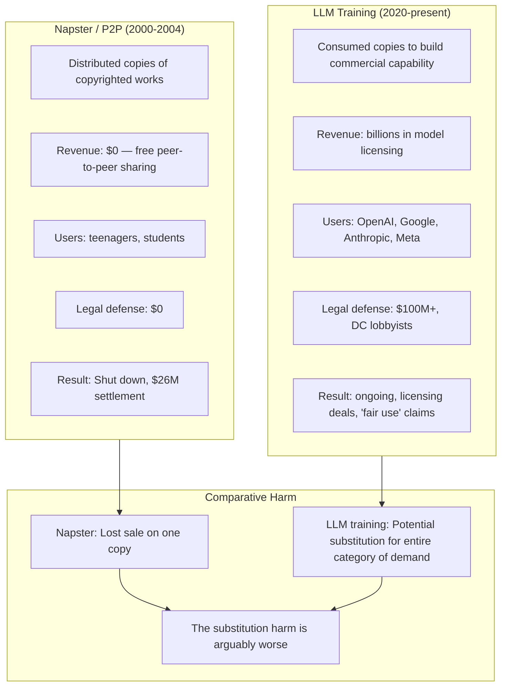

The same capital that went after Napster, individual torrent users, and enforced DMCA takedowns to protect record company rent-seeking is now copyright blind when the defendant is a well-capitalized AI company with VC backing and Washington relationships.

## The Structural Comparison

The Napster parallel is exact but inverted: Napster distributed copies. LLM training consumed copies to build a capability that substitutes for the original. The substitution harm is arguably worse — you don't lose a sale, you lose the entire category of demand. A model trained on millions of photographs can now produce photographs on demand. The demand for stock photography hasn't just been reduced — the market category is structurally threatened.

## The Same Intermediaries, Different Layer

The record labels and publishers now doing licensing deals with AI companies are again monetising others' work through the same intermediary rent extraction. The artists whose work was scraped see none of the licensing revenue. The labels and publishers collect it as representatives of "the industry."

This is structurally identical to the pre-streaming era: labels owned the masters, kept most of the revenue, artists were paid a royalty fraction. When Spotify paid the industry, the same dynamic reproduced: labels negotiated equity stakes and large upfront payments; artists got streaming pennies.

The AI licensing deal is a third iteration: publishers and labels negotiate AI licensing fees from OpenAI/Google, capturing rent on their catalog. The individual authors and musicians whose work trained the models receive nothing. The intermediary extracts twice: once when the work was originally created, once when it is licensed to AI companies.

## The Actual Principle

Copyright law was designed to give creators a limited monopoly to fund continued creation. The current system functions to give intermediaries a permanent revenue stream regardless of creator welfare. That was true before AI. AI just made the mechanism visible again.

The question worth asking: If copyright is about incentivizing creation, what are the creators incentivized to create if the reward flows to their distributors? The answer is the same as it was in 2003: they create anyway, because they can't not, and the intermediaries clip the ticket at every stage.
