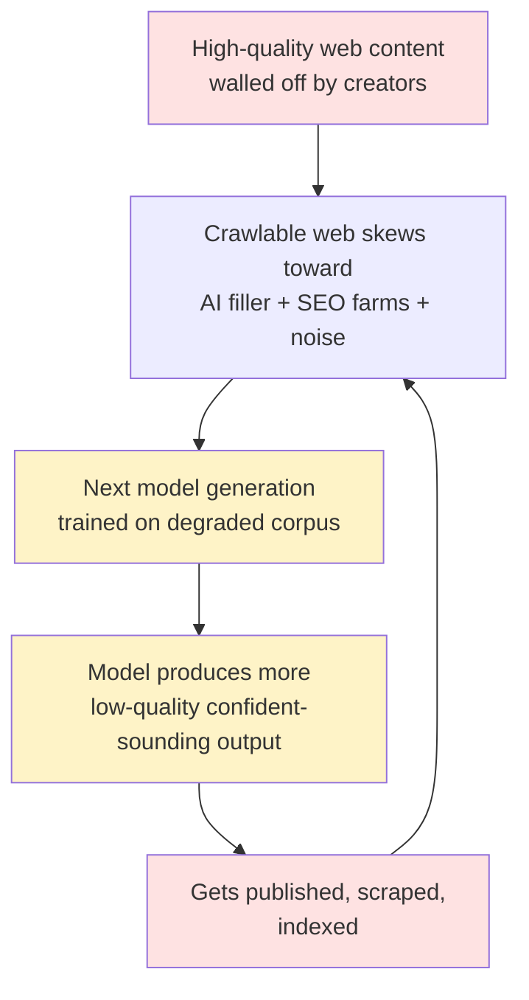

As high-quality content gets walled off, the crawlable web skews toward AI-generated filler, SEO farms, marketing copy, and social media noise. Each training generation ingests a worse ratio. Models trained on this output produce more of it. That gets scraped. The next generation is worse.

The ouroboros of mediocrity — LLMs trained on LLM-generated LinkedIn slop, confidently producing more of it.

## The Bifurcation

The inevitable split:

| High-value lane | Commodity lane |
|---|---|
| Licensed enterprise pipelines (Bloomberg + LLM) | Consumer LLM on public web |
| Proprietary corpus models | Expensive autocomplete for mediocre content |
| User-provided context at query time | Trained on its own output |
| Verified domain experts | "As an AI language model..." |

## The Timeline

The open web as training substrate is probably a **2015–2024 phenomenon**. Before 2015: too little web content at scale. After 2024: the good stuff is behind walls, the rest is synthetic. That window was the anomaly, not the norm.

## What Survives

Three knowledge architectures that resist the spiral:

1. **Licensed corpus** — Bloomberg, Reuters, academic publishers. Expensive, gated, accurate.
2. **Consented open corpus** — Wikipedia model. Community-governed, high signal.
3. **User-provided context** — RAG over your own documents. You control quality.

The public crawl as the foundation of general-purpose AI capability is a temporary historical accident, not a permanent feature.
