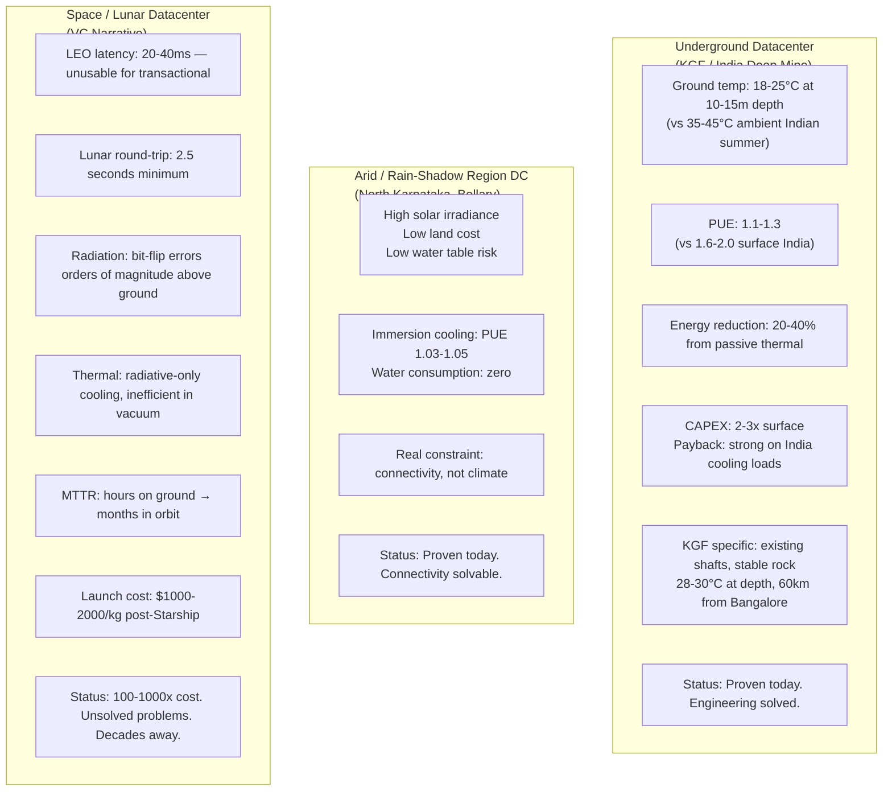
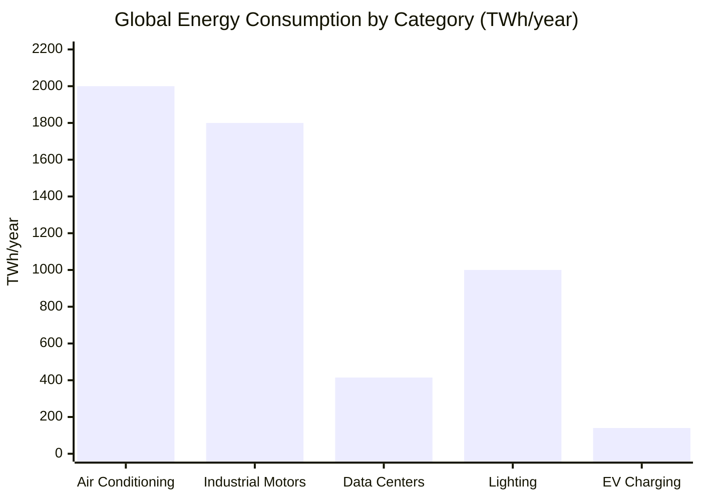

Space and moon datacenters are a VC narrative, not an engineering proposition. Underground and arid-region alternatives are available today at a fraction of the cost and solve the same underlying problem — cheap cooling and cheap power.

## The Engineering Comparison

## The KGF Opportunity — Specifically

Kolar Gold Fields is the most compelling specific case:
- Existing deep mine shafts — no excavation cost
- Stable granite rock at 28-30°C at depth — better than most underground alternatives globally
- ~60km from Bangalore's hyperscale demand center — fiber connectivity straightforward
- Abandoned infrastructure available at low cost — the mines are not actively used
- Purpose-built for latency-tolerant AI training workloads where power cost and PUE dominate

The hyperscale math works: AI training doesn't need 10ms latency. It needs cheap power and thermal stability. Underground KGF delivers both. The "why hasn't this been done" question is not engineering — it's land rights, environmental clearance, and the fact that hyperscale operators default to proven greenfield sites over novel infrastructure.

## The Scale Context That's Usually Missing

Global AC: ~2,000 TWh/year
All data centers: ~415 TWh/year

AC is 5x the current data center problem and grows at comparable rates through 2030, especially in warming South Asia. The AI datacenter energy panic is real — but the scale framing is usually missing context. A warming India expanding residential and commercial AC is the larger energy story.

This matters for the underground/arid datacenter case: the same passive cooling physics that makes underground DCs efficient could be applied to building design. The principle (use earth's thermal mass) is more broadly applicable than just datacenters.
