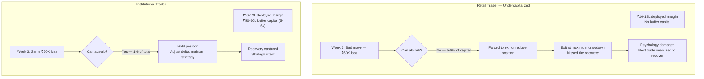
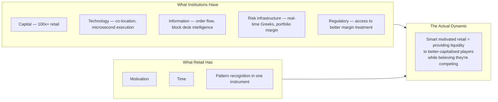

The hypothesis being tested: can a smart, disciplined retail trader make money in FNO? The learning: capital is essential — without it, smartness and discipline are not effective. It is a structurally rigged game, not conspiratorially but architecturally.

## The Capital Buffer Problem

The private jet vs single-engine glider framing: It is not just the 10-12 lakhs deployed margin. It is the 5-6x buffer — the ability to survive a ₹50K-1 lakh loss in a bad week without being forced out at the worst moment.

The buffer is the capital advantage, not the deployed margin. Two traders with the same deployed margin have very different games depending on the buffer.

## The Structural Asymmetries

Transaction costs are regressive: brokerage + STT + GST + SEBI charges hit small players proportionally harder. On a ₹1L position with ₹2K in charges per round trip, you need 2% net movement to break even. On a ₹1Cr position, same charges = 0.2%. The friction is identical in rupees but 10x worse as a percentage of capital.

## The SEBI Signal

SEBI's lot size increases over 2023-2024 implicitly acknowledged the retail capital problem without saying it openly. Increasing the minimum lot size forces higher capital requirements, which forces out undercapitalized participants. The regulatory response was to raise the barrier rather than to explain why the barrier existed.

This is valuable information: SEBI framework design is done by people who understand instruments theoretically, not experientially as retail participants. The vantage point — retail trading experience + platform architecture understanding + market structure knowledge — is genuinely rare and genuinely needed in policy discussions.

## What Would Actually Help

Not a ban on retail FNO (which SEBI has occasionally considered). Transparent disclosure of structural requirements:

1. **Capital adequacy disclosure**: "This strategy has a historical maximum drawdown of X%. You need at least 3-5x that amount in buffer capital to have a reasonable probability of surviving long enough to capture strategy edge."

2. **Cost-to-profit ratio**: "Your current position size generates ₹X in transaction costs per round trip. You need Y% net move to break even."

3. **Institutional comparison**: "Your counterparty in this trade has co-location access, real-time portfolio margining, and 24/7 risk infrastructure. Are you confident in your edge?"

Most retail participants would make different sizing decisions with this information. The game isn't unwinnable — it just requires capital that isn't disclosed as a prerequisite.
