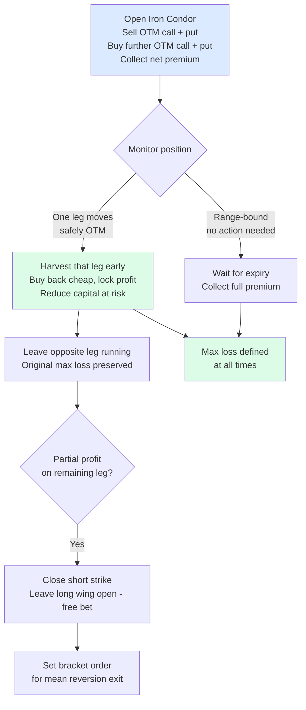
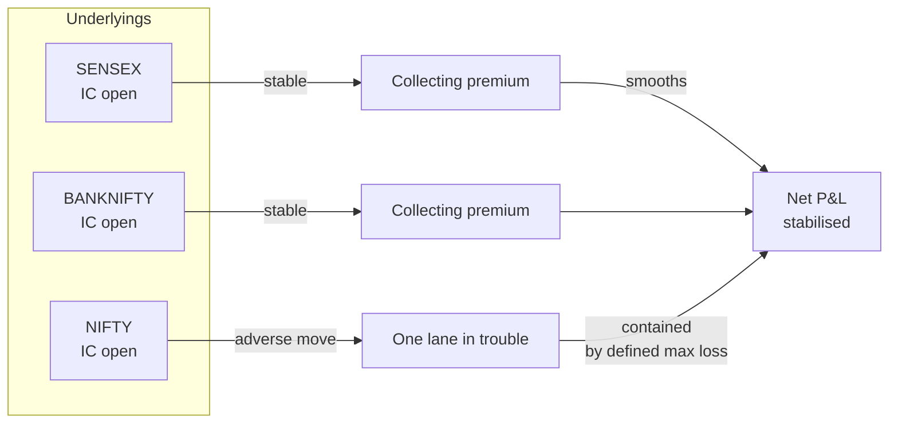
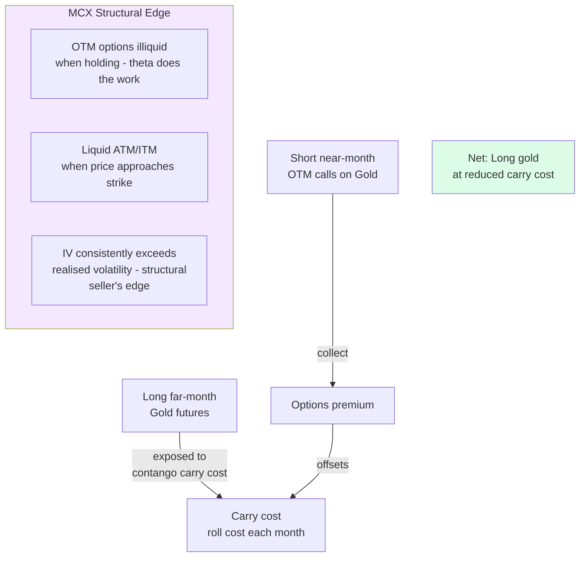
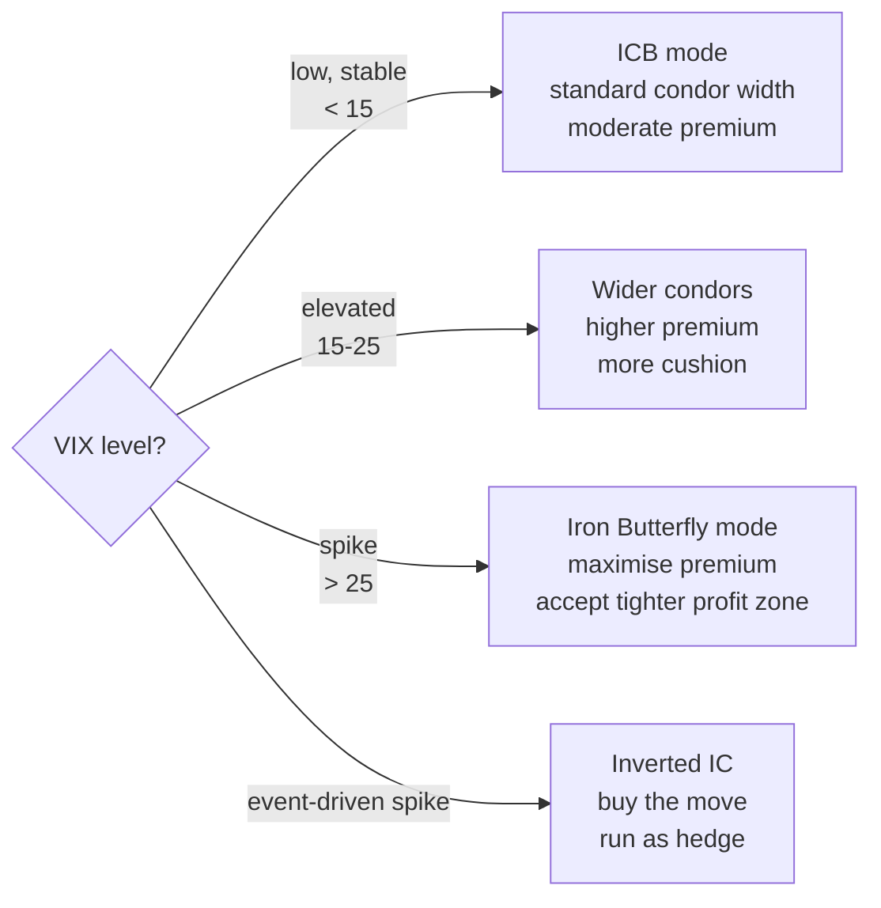

A systematic options income strategy built around iron condors with a dynamic mid-cycle harvesting overlay. The name captures two modes: steady-state income generation (cruise) and opportunistic extraction when one side of the condor moves safely out of the money (harvest).

The non-negotiable design principle: **defined max loss on every trade**. This is the property that makes systematic discipline possible.

## The Core Iron Condor Mechanics

## Multi-Underlying Structure

Running NIFTY, SENSEX, and BANKNIFTY concurrently provides natural smoothing:

## Commodity Extension: Gold/Silver Calendar

## Strategy Variants

| Variant | Use case | Max loss | Premium |
|---|---|---|---|
| Iron Condor (base) | Normal markets | Defined | Moderate |
| Iron Butterfly | IV spike environments | Defined | High |
| Inverted IC (Short IC) | Pre-event hedge | Defined | — (paid) |
| Short Strangle | — | **Undefined** | High |

Short strangle is **excluded**. Breaking the defined max loss property changes the fundamental nature of the strategy and the psychological contract that makes it sustainable.

## The Gear-Shifting Model

